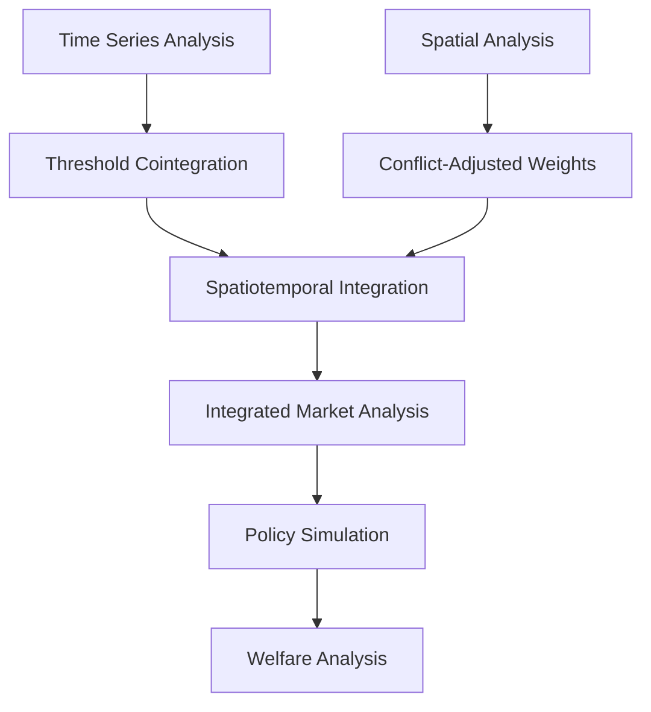
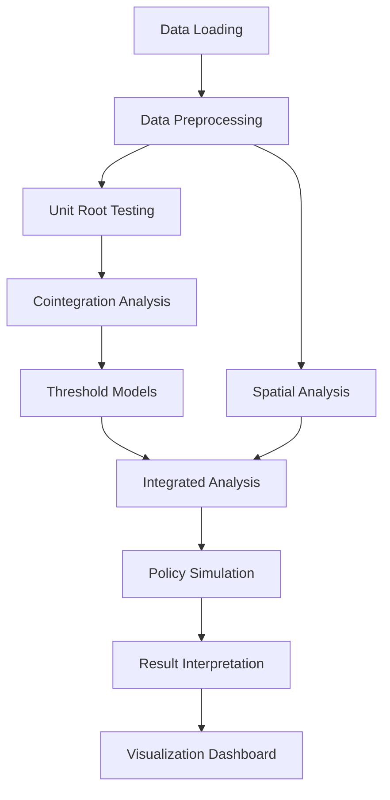

# Yemen Market Integration Project: Comprehensive Integration Plan

## Overview

This document outlines a comprehensive plan for integrating all components of the Yemen Market Integration project and creating additional helper functions for result interpretation and conclusion. The plan leverages the existing modules in `src/data`, `src/models`, `src/simulation`, `src/utils`, and `src/visualization` to create a cohesive analysis framework.

## Current Project Structure

The project has a well-organized structure with specialized modules:

- **src/data**: Data loading, preprocessing, and integration
- **src/models**: Econometric models (unit root, cointegration, threshold, spatial)
- **src/simulation**: Policy simulation capabilities
- **src/utils**: Utility functions for performance, validation, etc.
- **src/visualization**: Visualization components for different analysis types

## Integration Strategy

### 1. Spatiotemporal Integration



### 2. Comprehensive Analysis Workflow



## New Helper Functions to Implement

### 1. Integrated Analysis Functions

#### 1.1 Spatiotemporal Integration Module

Create a new module `src/models/spatiotemporal.py` with the following functions:

```python
def integrate_time_series_spatial_results(time_series_results, spatial_results, commodity):
    """
    Integrate time series and spatial analysis results for comprehensive market analysis.
    
    Parameters
    ----------
    time_series_results : dict
        Results from threshold cointegration analysis
    spatial_results : dict
        Results from spatial econometric analysis
    commodity : str
        Commodity name
        
    Returns
    -------
    dict
        Integrated analysis results
    """
    integrated_results = {}
    
    # Extract key metrics from time series analysis
    if time_series_results and 'tvecm' in time_series_results:
        tvecm_result = time_series_results['tvecm']
        integrated_results['threshold'] = tvecm_result.get('threshold')
        integrated_results['adjustment_below'] = tvecm_result.get('adjustment_below_1')
        integrated_results['adjustment_above'] = tvecm_result.get('adjustment_above_1')
        
        # Calculate half-lives if adjustment parameters are available
        if 'adjustment_below_1' in tvecm_result and 'adjustment_above_1' in tvecm_result:
            adj_below = tvecm_result['adjustment_below_1']
            adj_above = tvecm_result['adjustment_above_1']
            
            if adj_below != 0:
                half_life_below = np.log(0.5) / np.log(1 + adj_below)
                integrated_results['half_life_below'] = half_life_below
            else:
                integrated_results['half_life_below'] = float('inf')
                
            if adj_above != 0:
                half_life_above = np.log(0.5) / np.log(1 + adj_above)
                integrated_results['half_life_above'] = half_life_above
            else:
                integrated_results['half_life_above'] = float('inf')
    
    # Extract key metrics from spatial analysis
    if spatial_results and 'global_moran' in spatial_results:
        global_moran = spatial_results['global_moran']
        if global_moran:
            integrated_results['spatial_autocorrelation'] = global_moran['I']
            integrated_results['spatial_p_value'] = global_moran['p']
        
        if 'lag_model' in spatial_results and spatial_results['lag_model']:
            lag_model = spatial_results['lag_model']
            integrated_results['spatial_dependence'] = lag_model.rho
            integrated_results['spatial_r_squared'] = lag_model.r2
    
    # Calculate integrated metrics
    integrated_results['integration_index'] = calculate_integration_index(
        time_series_results, spatial_results
    )
    
    integrated_results['market_clusters'] = identify_market_clusters(
        time_series_results, spatial_results
    )
    
    integrated_results['regime_boundary_effects'] = analyze_regime_boundaries(
        time_series_results, spatial_results
    )
    
    return integrated_results
```

```python
def calculate_integration_index(time_series_results, spatial_results):
    """
    Calculate a composite market integration index combining time series and spatial metrics.
    
    Parameters
    ----------
    time_series_results : dict
        Results from threshold cointegration analysis
    spatial_results : dict
        Results from spatial econometric analysis
        
    Returns
    -------
    float
        Composite market integration index (0-1 scale)
    """
    # Initialize weights and components
    weights = {
        'cointegration': 0.3,
        'threshold': 0.2,
        'spatial_autocorrelation': 0.2,
        'spatial_dependence': 0.3
    }
    
    components = {}
    
    # Calculate cointegration component (0-1 scale)
    if time_series_results and 'cointegration' in time_series_results:
        coint_result = time_series_results['cointegration']
        if coint_result['cointegrated']:
            # Stronger cointegration = higher value
            p_value = coint_result['p_value']
            components['cointegration'] = 1 - min(p_value * 20, 0.99)  # Transform p-value to 0-1 scale
        else:
            components['cointegration'] = 0
    else:
        # No cointegration results available
        components['cointegration'] = 0
        weights = {k: v / (1 - weights['cointegration']) for k, v in weights.items() if k != 'cointegration'}
        weights['cointegration'] = 0
    
    # Calculate threshold component (0-1 scale)
    if time_series_results and 'tvecm' in time_series_results:
        tvecm_result = time_series_results['tvecm']
        if 'threshold' in tvecm_result:
            # Lower threshold = higher integration
            threshold = tvecm_result['threshold']
            # Normalize threshold (assuming typical range 0-0.5)
            components['threshold'] = max(0, 1 - threshold * 2)
        else:
            components['threshold'] = 0
    else:
        # No threshold results available
        components['threshold'] = 0
        weights = {k: v / (1 - weights['threshold']) for k, v in weights.items() if k != 'threshold'}
        weights['threshold'] = 0
    
    # Calculate spatial autocorrelation component (0-1 scale)
    if spatial_results and 'global_moran' in spatial_results:
        global_moran = spatial_results['global_moran']
        if global_moran:
            # Higher positive autocorrelation = higher integration
            moran_i = global_moran['I']
            # Transform Moran's I (-1 to 1) to 0-1 scale
            components['spatial_autocorrelation'] = (moran_i + 1) / 2
        else:
            components['spatial_autocorrelation'] = 0.5  # Neutral value
    else:
        # No spatial autocorrelation results available
        components['spatial_autocorrelation'] = 0.5  # Neutral value
        weights = {k: v / (1 - weights['spatial_autocorrelation']) for k, v in weights.items() if k != 'spatial_autocorrelation'}
        weights['spatial_autocorrelation'] = 0
    
    # Calculate spatial dependence component (0-1 scale)
    if spatial_results and 'lag_model' in spatial_results and spatial_results['lag_model']:
        lag_model = spatial_results['lag_model']
        # Higher spatial dependence = higher integration
        rho = lag_model.rho
        # Transform rho (typically 0-1) to 0-1 scale
        components['spatial_dependence'] = min(max(rho, 0), 1)
    else:
        # No spatial dependence results available
        components['spatial_dependence'] = 0
        weights = {k: v / (1 - weights['spatial_dependence']) for k, v in weights.items() if k != 'spatial_dependence'}
        weights['spatial_dependence'] = 0
    
    # Calculate weighted average
    integration_index = sum(weights[k] * components[k] for k in components)
    
    return integration_index
```

```python
def identify_market_clusters(time_series_results, spatial_results):
    """
    Identify market clusters based on integration patterns.
    
    Parameters
    ----------
    time_series_results : dict
        Results from threshold cointegration analysis
    spatial_results : dict
        Results from spatial econometric analysis
        
    Returns
    -------
    dict
        Market clusters with integration characteristics
    """
    clusters = {}
    
    # Extract local indicators of spatial association if available
    if spatial_results and hasattr(spatial_results['model'], 'gdf'):
        gdf = spatial_results['model'].gdf
        
        if 'lisa_cluster' in gdf.columns:
            # Count markets in each cluster type
            cluster_counts = gdf['lisa_cluster'].value_counts().to_dict()
            
            # Map cluster codes to descriptions
            cluster_descriptions = {
                0: 'Not Significant',
                1: 'High-High (Hotspot)',
                2: 'Low-Low (Coldspot)',
                3: 'High-Low (Outlier)',
                4: 'Low-High (Outlier)'
            }
            
            # Create cluster summary
            clusters['spatial'] = {
                'counts': {cluster_descriptions[k]: v for k, v in cluster_counts.items() if k in cluster_descriptions},
                'description': 'Markets grouped by price similarity and spatial proximity'
            }
            
            # Calculate average price by cluster
            if 'price' in gdf.columns:
                clusters['spatial']['avg_price'] = {
                    cluster_descriptions[k]: gdf[gdf['lisa_cluster'] == k]['price'].mean()
                    for k in cluster_counts.keys() if k in cluster_descriptions
                }
    
    # Add exchange rate regime clustering
    if spatial_results and hasattr(spatial_results['model'], 'gdf'):
        gdf = spatial_results['model'].gdf
        
        if 'exchange_rate_regime' in gdf.columns:
            # Count markets in each regime
            regime_counts = gdf['exchange_rate_regime'].value_counts().to_dict()
            
            # Create regime summary
            clusters['regime'] = {
                'counts': regime_counts,
                'description': 'Markets grouped by exchange rate regime'
            }
            
            # Calculate average price by regime
            if 'price' in gdf.columns:
                clusters['regime']['avg_price'] = {
                    regime: gdf[gdf['exchange_rate_regime'] == regime]['price'].mean()
                    for regime in regime_counts.keys()
                }
    
    # Add threshold-based clustering if available
    if time_series_results and 'tvecm' in time_series_results:
        tvecm_result = time_series_results['tvecm']
        
        if 'threshold' in tvecm_result:
            threshold = tvecm_result['threshold']
            
            clusters['threshold'] = {
                'threshold_value': threshold,
                'description': 'Markets grouped by price differential relative to threshold'
            }
    
    return clusters
```

```python
def analyze_regime_boundaries(time_series_results, spatial_results):
    """
    Analyze price transmission across exchange rate regime boundaries.
    
    Parameters
    ----------
    time_series_results : dict
        Results from threshold cointegration analysis
    spatial_results : dict
        Results from spatial econometric analysis
        
    Returns
    -------
    dict
        Analysis of regime boundary effects
    """
    boundary_effects = {}
    
    # Check if we have spatial model with regime information
    if spatial_results and hasattr(spatial_results['model'], 'gdf'):
        gdf = spatial_results['model'].gdf
        
        if 'exchange_rate_regime' in gdf.columns:
            # Calculate price differential across regimes
            north_price = gdf[gdf['exchange_rate_regime'] == 'north']['price'].mean()
            south_price = gdf[gdf['exchange_rate_regime'] == 'south']['price'].mean()
            
            price_diff = abs(north_price - south_price)
            price_ratio = max(north_price, south_price) / min(north_price, south_price)
            
            boundary_effects['price_differential'] = price_diff
            boundary_effects['price_ratio'] = price_ratio
            
            # Calculate exchange rate adjusted price differential
            if 'usdprice' in gdf.columns:
                north_usd = gdf[gdf['exchange_rate_regime'] == 'north']['usdprice'].mean()
                south_usd = gdf[gdf['exchange_rate_regime'] == 'south']['usdprice'].mean()
                
                usd_diff = abs(north_usd - south_usd)
                usd_ratio = max(north_usd, south_usd) / min(north_usd, south_usd)
                
                boundary_effects['usd_price_differential'] = usd_diff
                boundary_effects['usd_price_ratio'] = usd_ratio
                
                # Calculate boundary effect (how much of price differential is due to exchange rate)
                if price_diff > 0:
                    exchange_rate_effect = (price_diff - usd_diff) / price_diff
                    boundary_effects['exchange_rate_effect'] = exchange_rate_effect
    
    # Add threshold information if available
    if time_series_results and 'tvecm' in time_series_results:
        tvecm_result = time_series_results['tvecm']
        
        if 'threshold' in tvecm_result:
            threshold = tvecm_result['threshold']
            
            # Compare threshold to price differential
            if 'price_differential' in boundary_effects:
                price_diff = boundary_effects['price_differential']
                
                # Check if price differential exceeds threshold
                boundary_effects['exceeds_threshold'] = price_diff > threshold
                boundary_effects['diff_to_threshold_ratio'] = price_diff / threshold if threshold > 0 else float('inf')
    
    return boundary_effects
```

#### 1.2 Result Interpretation Module

Create a new module `src/models/interpretation.py` with the following functions:

```python
def interpret_unit_root_results(unit_root_results, commodity):
    """
    Provide contextual interpretation of unit root test results.
    
    Parameters
    ----------
    unit_root_results : dict
        Results from unit root testing
    commodity : str
        Commodity name
        
    Returns
    -------
    dict
        Interpretation of unit root results with economic insights
    """
    interpretation = {
        'commodity': commodity,
        'summary': '',
        'details': {},
        'implications': []
    }
    
    # Check if we have valid results
    if not unit_root_results:
        interpretation['summary'] = "Insufficient data for unit root analysis."
        return interpretation
    
    # Extract integration orders
    north_order = unit_root_results['north']['integration_order']
    south_order = unit_root_results['south']['integration_order']
    
    # Interpret integration orders
    if north_order == 1 and south_order == 1:
        interpretation['summary'] = f"Both north and south {commodity} price series are integrated of order 1 (I(1)), indicating non-stationary price levels but stationary price changes."
        interpretation['implications'].append("The I(1) nature of both series makes them suitable for cointegration analysis.")
        interpretation['implications'].append("Price shocks have permanent effects, suggesting market inefficiencies or structural barriers.")
    elif north_order == 0 and south_order == 0:
        interpretation['summary'] = f"Both north and south {commodity} price series are integrated of order 0 (I(0)), indicating stationary price levels."
        interpretation['implications'].append("The I(0) nature of both series suggests that price shocks are temporary and markets quickly return to equilibrium.")
        interpretation['implications'].append("Standard cointegration analysis is not applicable, but direct correlation analysis can be performed.")
    else:
        interpretation['summary'] = f"The north {commodity} price series is I({north_order}) while the south series is I({south_order}), indicating different time series properties."
        interpretation['implications'].append("The different integration orders suggest structural differences between north and south markets.")
        interpretation['implications'].append("Standard cointegration analysis may not be appropriate without further transformations.")
    
    # Check for structural breaks
    north_za = unit_root_results['north']['zivot_andrews']
    south_za = unit_root_results['south']['zivot_andrews']
    
    if north_za['stationary'] or south_za['stationary']:
        interpretation['details']['structural_breaks'] = "Structural breaks detected in the price series."
        
        if 'breakpoint' in north_za and 'breakpoint' in unit_root_results['merged_data']:
            breakpoint_date = unit_root_results['merged_data']['date'].iloc[north_za['breakpoint']]
            interpretation['details']['north_break'] = f"North market experienced a structural break around {breakpoint_date.strftime('%Y-%m-%d')}."
        
        if 'breakpoint' in south_za and 'breakpoint' in unit_root_results['merged_data']:
            breakpoint_date = unit_root_results['merged_data']['date'].iloc[south_za['breakpoint']]
            interpretation['details']['south_break'] = f"South market experienced a structural break around {breakpoint_date.strftime('%Y-%m-%d')}."
        
        interpretation['implications'].append("The presence of structural breaks suggests significant market disruptions, possibly due to conflict events, policy changes, or supply chain disruptions.")
        interpretation['implications'].append("Analysis should account for these breaks to avoid biased results.")
    
    return interpretation
```

```python
def interpret_cointegration_results(cointegration_results, commodity):
    """
    Provide contextual interpretation of cointegration test results.
    
    Parameters
    ----------
    cointegration_results : dict
        Results from cointegration testing
    commodity : str
        Commodity name
        
    Returns
    -------
    dict
        Interpretation of cointegration results with economic insights
    """
    interpretation = {
        'commodity': commodity,
        'summary': '',
        'details': {},
        'implications': []
    }
    
    # Check if we have valid results
    if not cointegration_results:
        interpretation['summary'] = "Insufficient data for cointegration analysis."
        return interpretation
    
    # Extract test results
    eg_result = cointegration_results['engle_granger']
    jo_result = cointegration_results['johansen']
    gh_result = cointegration_results['gregory_hansen']
    
    # Determine overall cointegration status
    is_cointegrated = eg_result['cointegrated'] or jo_result['rank_trace'] > 0 or gh_result['cointegrated']
    
    if is_cointegrated:
        interpretation['summary'] = f"North and south {commodity} markets show evidence of cointegration, indicating a long-run equilibrium relationship despite short-term deviations."
        
        # Add details about which tests show cointegration
        cointegration_tests = []
        if eg_result['cointegrated']:
            cointegration_tests.append("Engle-Granger")
        if jo_result['rank_trace'] > 0:
            cointegration_tests.append("Johansen")
        if gh_result['cointegrated']:
            cointegration_tests.append("Gregory-Hansen")
        
        interpretation['details']['cointegration_tests'] = f"Cointegration detected by the following tests: {', '.join(cointegration_tests)}."
        
        # Add implications
        interpretation['implications'].append("The presence of cointegration suggests that despite conflict barriers, markets maintain long-run price relationships.")
        interpretation['implications'].append("Price deviations between markets are temporary, with economic forces driving prices back to equilibrium over time.")
        interpretation['implications'].append("Market integration exists, though the speed of adjustment may be affected by conflict and transaction costs.")
    else:
        interpretation['summary'] = f"North and south {commodity} markets do not show strong evidence of cointegration, suggesting market fragmentation."
        
        # Add details about which tests failed to show cointegration
        failed_tests = []
        if not eg_result['cointegrated']:
            failed_tests.append("Engle-Granger")
        if jo_result['rank_trace'] == 0:
            failed_tests.append("Johansen")
        if not gh_result['cointegrated']:
            failed_tests.append("Gregory-Hansen")
        
        interpretation['details']['failed_tests'] = f"Cointegration not detected by the following tests: {', '.join(failed_tests)}."
        
        # Add implications
        interpretation['implications'].append("The lack of cointegration suggests that conflict barriers have effectively fragmented markets.")
        interpretation['implications'].append("Price deviations between markets can persist indefinitely, indicating inefficient resource allocation.")
        interpretation['implications'].append("Policy interventions may be needed to restore market integration.")
    
    # Check for structural breaks in cointegration
    if gh_result['cointegrated']:
        interpretation['details']['structural_break'] = "Cointegration with structural break detected."
        
        if 'breakpoint' in gh_result and 'breakpoint' in cointegration_results['merged_data']:
            breakpoint_date = cointegration_results['merged_data']['date'].iloc[gh_result['breakpoint']]
            interpretation['details']['break_date'] = f"Cointegration relationship changed around {breakpoint_date.strftime('%Y-%m-%d')}."
        
        interpretation['implications'].append("The nature of market integration changed at some point, possibly due to conflict events or policy changes.")
        interpretation['implications'].append("Analysis should account for this structural change in the cointegration relationship.")
    
    return interpretation
```

```python
def interpret_threshold_results(threshold_results, commodity):
    """
    Provide economic interpretation of threshold cointegration results.
    
    Parameters
    ----------
    threshold_results : dict
        Results from threshold cointegration analysis
    commodity : str
        Commodity name
        
    Returns
    -------
    dict
        Interpretation of threshold results with economic insights
    """
    interpretation = {
        'commodity': commodity,
        'summary': '',
        'details': {},
        'implications': []
    }
    
    # Check if we have valid results
    if not threshold_results or 'tvecm' not in threshold_results:
        interpretation['summary'] = "Insufficient data for threshold analysis."
        return interpretation
    
    tvecm_result = threshold_results['tvecm']
    
    # Check if threshold was found
    if 'threshold' not in tvecm_result:
        interpretation['summary'] = f"No significant threshold effect detected for {commodity} markets."
        interpretation['implications'].append("The absence of a threshold suggests that price adjustment is linear, without distinct regimes.")
        return interpretation
    
    # Extract threshold and adjustment parameters
    threshold = tvecm_result['threshold']
    
    interpretation['summary'] = f"A threshold effect was detected for {commodity} markets with a threshold value of {threshold:.4f}."
    interpretation['details']['threshold'] = threshold
    
    # Interpret threshold value
    interpretation['details']['threshold_interpretation'] = f"The threshold of {threshold:.4f} represents the price differential at which the adjustment mechanism changes. This can be interpreted as the transaction cost or barrier to arbitrage between north and south markets."
    
    # Check if we have adjustment parameters
    if 'adjustment_below_1' in tvecm_result and 'adjustment_above_1' in tvecm_result:
        adj_below = tvecm_result['adjustment_below_1']
        adj_above = tvecm_result['adjustment_above_1']
        
        interpretation['details']['adjustment_below'] = adj_below
        interpretation['details']['adjustment_above'] = adj_above
        
        # Calculate half-lives
        if adj_below != 0:
            half_life_below = np.log(0.5) / np.log(1 + adj_below)
            interpretation['details']['half_life_below'] = half_life_below
        else:
            interpretation['details']['half_life_below'] = float('inf')
            
        if adj_above != 0:
            half_life_above = np.log(0.5) / np.log(1 + adj_above)
            interpretation['details']['half_life_above'] = half_life_above
        else:
            interpretation['details']['half_life_above'] = float('inf')
        
        # Interpret adjustment speeds
        if abs(adj_below) < abs(adj_above):
            interpretation['details']['adjustment_pattern'] = "The adjustment speed is faster when price deviations exceed the threshold."
            interpretation['implications'].append("Large price differentials between north and south markets are corrected more quickly, while small deviations persist longer.")
            interpretation['implications'].append("This suggests that arbitrage only becomes profitable when price differences are large enough to overcome transaction costs.")
        elif abs(adj_below) > abs(adj_above):
            interpretation['details']['adjustment_pattern'] = "The adjustment speed is faster when price deviations are below the threshold."
            interpretation['implications'].append("Small price differentials between north and south markets are corrected quickly, while large deviations persist longer.")
            interpretation['implications'].append("This unusual pattern may indicate institutional barriers or conflict-related constraints that make large price differences difficult to arbitrage away.")
        else:
            interpretation['details']['adjustment_pattern'] = "The adjustment speeds are similar above and below the threshold."
            interpretation['implications'].append("Price deviations are corrected at similar rates regardless of their size, suggesting symmetric price transmission.")
    
    # Check if we have M-TAR results
    if 'mtar' in threshold_results:
        mtar_result = threshold_results['mtar']
        
        if 'asymmetric' in mtar_result and mtar_result['asymmetric']:
            interpretation['details']['directional_asymmetry'] = "Directional asymmetry detected in price adjustment."
            
            if 'adjustment_positive' in mtar_result and 'adjustment_negative' in mtar_result:
                adj_pos = mtar_result['adjustment_positive']
                adj_neg = mtar_result['adjustment_negative']
                
                interpretation['details']['adjustment_positive'] = adj_pos
                interpretation['details']['adjustment_negative'] = adj_neg
                
                if abs(adj_pos) < abs(adj_neg):
                    interpretation['details']['directional_pattern'] = "Price decreases are transmitted more quickly than price increases."
                    interpretation['implications'].append("The faster adjustment to price decreases suggests competitive market behavior.")
                elif abs(adj_pos) > abs(adj_neg):
                    interpretation['details']['directional_pattern'] = "Price increases are transmitted more quickly than price decreases."
                    interpretation['implications'].append("The faster adjustment to price increases suggests market power or information asymmetries.")
    
    # Add policy implications
    interpretation['implications'].append(f"The threshold of {threshold:.4f} provides a quantitative measure of transaction costs between markets that could be targeted by policy interventions.")
    interpretation['implications'].append("Reducing conflict barriers and transaction costs could lower this threshold and improve market integration.")
    
    return interpretation
```

```python
def interpret_spatial_results(spatial_results, commodity):
    """
    Provide economic interpretation of spatial econometric results.
    
    Parameters
    ----------
    spatial_results : dict
        Results from spatial econometric analysis
    commodity : str
        Commodity name
        
    Returns
    -------
    dict
        Interpretation of spatial results with economic insights
    """
    interpretation = {
        'commodity': commodity,
        'summary': '',
        'details': {},
        'implications': []
    }
    
    # Check if we have valid results
    if not spatial_results:
        interpretation['summary'] = "Insufficient data for spatial analysis."
        return interpretation
    
    # Check for global spatial autocorrelation
    if 'global_moran' in spatial_results and spatial_results['global_moran']:
        global_moran = spatial_results['global_moran']
        
        interpretation['details']['morans_i'] = global_moran['I']
        interpretation['details']['morans_p'] = global_moran['p']
        
        if global_moran['p'] < 0.05:
            if global_moran['I'] > 0:
                interpretation['details']['spatial_pattern'] = "Significant positive spatial autocorrelation detected."
                interpretation['summary'] = f"{commodity} prices show significant spatial clustering, with similar price levels in nearby markets."
                interpretation['implications'].append("The spatial clustering of prices suggests that geographic proximity influences price formation despite conflict barriers.")
                interpretation['implications'].append("Markets within the same region tend to have similar price levels, indicating some degree of regional integration.")
            else:
                interpretation['details']['spatial_pattern'] = "Significant negative spatial autocorrelation detected."
                interpretation['summary'] = f"{commodity} prices show significant spatial dispersion, with dissimilar price levels in nearby markets."
                interpretation['implications'].append("The spatial dispersion of prices suggests that geographic proximity does not lead to price similarity.")
                interpretation['implications'].append("This unusual pattern may indicate strong local market segmentation or conflict barriers between adjacent markets.")
        else:
            interpretation['details']['spatial_pattern'] = "No significant spatial autocorrelation detected."
            interpretation['summary'] = f"{commodity} prices show no significant spatial pattern, suggesting random distribution of prices across space."
            interpretation['implications'].append("The lack of spatial pattern suggests that geographic proximity has little influence on price formation.")
            interpretation['implications'].append("Markets appear to be spatially fragmented, possibly due to conflict barriers disrupting normal spatial price relationships.")
    
    # Check for spatial lag model results
    if 'lag_model' in spatial_results and spatial_results['lag_model']:
        lag_model = spatial_results['lag_model']
        
        interpretation['details']['spatial_dependence'] = lag_model.rho
        interpretation['details']['model_fit'] = lag_model.r2
        
        if lag_model.rho > 0:
            if lag_model.rho < 0.3:
                strength = "weak"
            elif lag_model.rho < 0.7:
                strength = "moderate"
            else:
                strength = "strong"
                
            interpretation['details']['dependence_strength'] = f"{strength.capitalize()} spatial dependence detected."
            interpretation['implications'].append(f"The {strength} spatial dependence suggests that prices in neighboring markets influence each other to some degree.")
            interpretation['implications'].append("This indicates partial market integration despite conflict barriers.")
        else:
            interpretation['details']['dependence_strength'] = "No positive spatial dependence detected."
            interpretation['implications'].append("The lack of positive spatial dependence suggests that prices in neighboring markets do not influence each other.")
            interpretation['implications'].append("This indicates severe market fragmentation due to conflict barriers.")
    
    # Check for spillover effects
    if 'spillover_effects' in spatial_results:
        spillover = spatial_results['spillover_effects']
        
        if 'conflict_intensity_normalized' in spillover['indirect']:
            conflict_indirect = spillover['indirect']['conflict_intensity_normalized']
            
            interpretation['details']['conflict_spillover'] = conflict_indirect
            
            if abs(conflict_indirect) > 0.1:
                interpretation['details']['conflict_effect'] = "Substantial indirect effect of conflict on prices."
                interpretation['implications'].append("Conflict in one area significantly affects prices in neighboring areas, suggesting conflict spillover effects on market integration.")
            else:
                interpretation['details']['conflict_effect'] = "Limited indirect effect of conflict on prices."
                interpretation['implications'].append("Conflict effects appear to be largely localized and do not significantly spill over to neighboring markets.")
    
    # Add policy implications
    interpretation['implications'].append("Spatial analysis provides insights for targeted interventions to improve market connectivity in specific regions.")
    interpretation['implications'].append("Reducing conflict in key market hubs could have multiplier effects on market integration due to spatial spillovers.")
    
    return interpretation
```

```python
def interpret_simulation_results(simulation_results, commodity):
    """
    Provide policy recommendations based on simulation results.
    
    Parameters
    ----------
    simulation_results : dict
        Results from policy simulations
    commodity : str
        Commodity name
        
    Returns
    -------
    dict
        Interpretation of simulation results with policy recommendations
    """
    interpretation = {
        'commodity': commodity,
        'summary': '',
        'policy_recommendations': [],
        'welfare_effects': {},
        'implementation_considerations': []
    }
    
    # Check if we have valid results
    if not simulation_results:
        interpretation['summary'] = "Insufficient data for policy simulation analysis."
        return interpretation
    
    # Extract welfare results
    if 'welfare' in simulation_results:
        welfare = simulation_results['welfare']
        
        # Determine which policy has the highest welfare gain
        best_policy = None
        best_welfare = -float('inf')
        
        policies = {}
        
        # Check exchange rate results
        if 'exchange_rate' in welfare:
            for target, results in welfare['exchange_rate'].items():
                for commodity_name, effects in results.items():
                    if commodity_name == commodity and 'total_welfare' in effects:
                        policies[f'exchange_rate_{target}'] = effects['total_welfare']
                        if effects['total_welfare'] > best_welfare:
                            best_welfare = effects['total_welfare']
                            best_policy = f'Exchange rate unification ({target})'
        
        # Check connectivity results
        if 'connectivity' in welfare:
            for scenario, results in welfare['connectivity'].items():
                for commodity_name, effects in results.items():
                    if commodity_name == commodity and 'total_welfare' in effects:
                        # Extract reduction percentage from scenario key
                        reduction_pct = scenario.split('_')[-1]
                        policies[f'connectivity_{reduction_pct}'] = effects['total_welfare']
                        if effects['total_welfare'] > best_welfare:
                            best_welfare = effects['total_welfare']
                            best_policy = f'Conflict reduction ({reduction_pct}%)'
        
        # Check combined results
        if 'combined' in welfare:
            for scenario, results in welfare['combined'].items():
                for commodity_name, effects in results.items():
                    if commodity_name == commodity and 'total_welfare' in effects:
                        policies[f'combined_{scenario}'] = effects['total_welfare']
                        if effects['total_welfare'] > best_welfare:
                            best_welfare = effects['total_welfare']
                            best_policy = f'Combined policies ({scenario})'
        
        # Set summary based on best policy
        if best_policy:
            interpretation['summary'] = f"Based on simulation results, {best_policy} provides the highest welfare gains for {commodity} markets."
            interpretation['welfare_effects']['best_policy'] = best_policy
            interpretation['welfare_effects']['welfare_gain'] = best_welfare
            interpretation['welfare_effects']['all_policies'] = policies
            
            # Add policy recommendations based on best policy
            if 'Exchange rate' in best_policy:
                interpretation['policy_recommendations'].append("Prioritize exchange rate unification to reduce price distortions between north and south markets.")
                interpretation['policy_recommendations'].append("Coordinate monetary policy between authorities in different regions to achieve sustainable unification.")
                interpretation['policy_recommendations'].append("Implement supporting fiscal measures to manage potential inflation impacts during transition.")
                
                interpretation['implementation_considerations'].append("Exchange rate unification may face political resistance from authorities benefiting from the current dual system.")
                interpretation['implementation_considerations'].append("A phased approach with clear communication may reduce market disruptions during implementation.")
            elif 'Conflict reduction' in best_policy:
                interpretation['policy_recommendations'].append("Prioritize conflict reduction measures to improve physical market connectivity.")
                interpretation['policy_recommendations'].append("Focus on securing key trade routes between north and south markets.")
                interpretation['policy_recommendations'].append("Establish market protection zones to facilitate safe trade in conflict-affected areas.")
                
                interpretation['implementation_considerations'].append("Conflict reduction requires coordination among multiple stakeholders, including security forces and local communities.")
                interpretation['implementation_considerations'].append("Initial focus on high-volume trade corridors may maximize early benefits.")
            elif 'Combined policies' in best_policy:
                interpretation['policy_recommendations'].append("Implement both exchange rate unification and conflict reduction measures simultaneously for maximum benefit.")
                interpretation['policy_recommendations'].append("Coordinate monetary and security policies to ensure synergistic effects.")
                interpretation['policy_recommendations'].append("Establish a comprehensive market integration program with both economic and security components.")
                
                interpretation['implementation_considerations'].append("Combined approach requires more resources but offers higher returns.")
                interpretation['implementation_considerations'].append("Careful sequencing of interventions may be necessary for practical implementation.")
    
    # Add distributional effects if available
    if 'welfare' in simulation_results and 'combined' in simulation_results['welfare']:
        for scenario, results in simulation_results['welfare']['combined'].items():
            for commodity_name, effects in results.items():
                if commodity_name == commodity and 'distributional' in effects:
                    dist = effects['distributional']
                    
                    interpretation['welfare_effects']['distributional'] = {
                        'gini_change': dist.get('gini_change'),
                        'bottom_quintile_impact': dist.get('bottom_quintile_impact'),
                        'food_security_improvement': dist.get('food_security_improvement')
                    }
                    
                    # Add distributional implications
                    if 'gini_change' in dist and dist['gini_change'] < 0:
                        interpretation['policy_recommendations'].append("The policy reduces inequality, providing additional social benefits beyond market efficiency.")
                    
                    if 'bottom_quintile_impact' in dist and dist['bottom_quintile_impact'] < 0:
                        interpretation['policy_recommendations'].append("The policy has positive impacts on the poorest households, making it particularly valuable for poverty reduction.")
                    
                    if 'food_security_improvement' in dist and dist['food_security_improvement'] > 0:
                        interpretation['policy_recommendations'].append(f"The policy improves food security by approximately {dist['food_security_improvement']:.1f}%, addressing a critical humanitarian concern.")
    
    # Add general recommendations
    interpretation['policy_recommendations'].append("Monitor market integration metrics regularly to assess policy effectiveness and make adjustments as needed.")
    interpretation['policy_recommendations'].append("Complement market integration policies with targeted support for vulnerable populations during transition periods.")
    
    return interpretation
```

### 2. Comprehensive Reporting Functions

Create a new module `src/models/reporting.py` with the following functions:

```python
def generate_comprehensive_report(all_results, commodity, output_path, logger):
    """
    Generate a comprehensive report of all analysis results.
    
    Parameters
    ----------
    all_results : dict
        Dictionary containing all analysis results
    commodity : str
        Commodity name
    output_path : pathlib.Path
        Path to save the report
    logger : logging.Logger
        Logger instance
        
    Returns
    -------
    pathlib.Path
        Path to the generated report
    """
    from src.models.interpretation import (
        interpret_unit_root_results,
        interpret_cointegration_results,
        interpret_threshold_results,
        interpret_spatial_results,
        interpret_simulation_results
    )
    
    # Generate interpretations
    interpretations = {}
    
    if 'unit_root_results' in all_results:
        interpretations['unit_root'] = interpret_unit_root_results(
            all_results['unit_root_results'], commodity
        )
    
    if 'cointegration_results' in all_results:
        interpretations['cointegration'] = interpret_cointegration_results(
            all_results['cointegration_results'], commodity
        )
    
    if 'threshold_results' in all_results:
        interpretations['threshold'] = interpret_threshold_results(
            all_results['threshold_results'], commodity
        )
    
    if 'spatial_results' in all_results:
        interpretations['spatial'] = interpret_spatial_results(
            all_results['spatial_results'], commodity
        )
    
    if 'simulation_results' in all_results:
        interpretations['simulation'] = interpret_simulation_results(
            all_results['simulation_results'], commodity
        )
    
    # Create report path
    report_path = output_path / f'{commodity.replace(" ", "_")}_comprehensive_report.md'
    
    # Write report
    with open(report_path, 'w') as f:
        f.write(f"# Yemen Market Integration Analysis: {commodity.capitalize()}\n\n")
        f.write(f"**Analysis Date:** {datetime.now().strftime('%Y-%m-%d')}\n\n")
        
        f.write("## Executive Summary\n\n")
        
        # Add key findings from interpretations
        if 'unit_root' in interpretations:
            f.write(f"- {interpretations['unit_root']['summary']}\n")
        
        if 'cointegration' in interpretations:
            f.write(f"- {interpretations['cointegration']['summary']}\n")
        
        if 'threshold' in interpretations:
            f.write(f"- {interpretations['threshold']['summary']}\n")
        
        if 'spatial' in interpretations:
            f.write(f"- {interpretations['spatial']['summary']}\n")
        
        if 'simulation' in interpretations:
            f.write(f"- {interpretations['simulation']['summary']}\n")
        
        # Add policy recommendations
        f.write("\n## Policy Recommendations\n\n")
        
        if 'simulation' in interpretations and 'policy_recommendations' in interpretations['simulation']:
            for recommendation in interpretations['simulation']['policy_recommendations']:
                f.write(f"- {recommendation}\n")
        
        # Add detailed results sections
        f.write("\n## Detailed Analysis Results\n\n")
        
        # Unit Root Analysis
        f.write("### Time Series Properties\n\n")
        if 'unit_root' in interpretations:
            f.write(f"{interpretations['unit_root']['summary']}\n\n")
            
            if 'details' in interpretations['unit_root']:
                for key, value in interpretations['unit_root']['details'].items():
                    f.write(f"- {value}\n")
            
            f.write("\n**Implications:**\n\n")
            for implication in interpretations['unit_root']['implications']:
                f.write(f"- {implication}\n")
        else:
            f.write("Unit root analysis not performed or insufficient data.\n")
        
        # Cointegration Analysis
        f.write("\n### Market Integration Analysis\n\n")
        if 'cointegration' in interpretations:
            f.write(f"{interpretations['cointegration']['summary']}\n\n")
            
            if 'details' in interpretations['cointegration']:
                for key, value in interpretations['cointegration']['details'].items():
                    f.write(f"- {value}\n")
            
            f.write("\n**Implications:**\n\n")
            for implication in interpretations['cointegration']['implications']:
                f.write(f"- {implication}\n")
        else:
            f.write("Cointegration analysis not performed or insufficient data.\n")
        
        # Threshold Analysis
        f.write("\n### Transaction Cost Analysis\n\n")
        if 'threshold' in interpretations:
            f.write(f"{interpretations['threshold']['summary']}\n\n")
            
            if 'details' in interpretations['threshold']:
                for key, value in interpretations['threshold']['details'].items():
                    if key == 'threshold':
                        f.write(f"- Estimated transaction cost threshold: {value:.4f}\n")
                    elif key == 'adjustment_below':
                        f.write(f"- Adjustment speed below threshold: {value:.4f}\n")
                    elif key == 'adjustment_above':
                        f.write(f"- Adjustment speed above threshold: {value:.4f}\n")
                    elif key == 'half_life_below':
                        f.write(f"- Half-life below threshold: {value:.2f} periods\n")
                    elif key == 'half_life_above':
                        f.write(f"- Half-life above threshold: {value:.2f} periods\n")
                    else:
                        f.write(f"- {value}\n")
            
            f.write("\n**Implications:**\n\n")
            for implication in interpretations['threshold']['implications']:
                f.write(f"- {implication}\n")
        else:
            f.write("Threshold analysis not performed or insufficient data.\n")
        
        # Spatial Analysis
        f.write("\n### Spatial Market Analysis\n\n")
        if 'spatial' in interpretations:
            f.write(f"{interpretations['spatial']['summary']}\n\n")
            
            if 'details' in interpretations['spatial']:
                for key, value in interpretations['spatial']['details'].items():
                    if key == 'morans_i':
                        f.write(f"- Moran's I statistic: {value:.4f}\n")
                    elif key == 'morans_p':
                        f.write(f"- Moran's I p-value: {value:.4f}\n")
                    elif key == 'spatial_dependence':
                        f.write(f"- Spatial dependence parameter: {value:.4f}\n")
                    elif key == 'model_fit':
                        f.write(f"- Spatial model R-squared: {value:.4f}\n")
                    else:
                        f.write(f"- {value}\n")
            
            f.write("\n**Implications:**\n\n")
            for implication in interpretations['spatial']['implications']:
                f.write(f"- {implication}\n")
        else:
            f.write("Spatial analysis not performed or insufficient data.\n")
        
        # Policy Simulation
        f.write("\n### Policy Simulation Results\n\n")
        if 'simulation' in interpretations:
            f.write(f"{interpretations['simulation']['summary']}\n\n")
            
            if 'welfare_effects' in interpretations['simulation']:
                welfare = interpretations['simulation']['welfare_effects']
                
                if 'best_policy' in welfare:
                    f.write(f"- Best policy option: {welfare['best_policy']}\n")
                
                if 'welfare_gain' in welfare:
                    f.write(f"- Estimated welfare gain: {welfare['welfare_gain']:.2f}\n")
                
                if 'distributional' in welfare:
                    dist = welfare['distributional']
                    
                    if 'gini_change' in dist:
                        f.write(f"- Change in inequality (Gini): {dist['gini_change']:.4f}\n")
                    
                    if 'bottom_quintile_impact' in dist:
                        f.write(f"- Price impact on bottom quintile: {dist['bottom_quintile_impact']:.2f}%\n")
                    
                    if 'food_security_improvement' in dist:
                        f.write(f"- Food security improvement: {dist['food_security_improvement']:.2f}%\n")
            
            f.write("\n**Implementation Considerations:**\n\n")
            for consideration in interpretations['simulation']['implementation_considerations']:
                f.write(f"- {consideration}\n")
        else:
            f.write("Policy simulation not performed or insufficient data.\n")
        
        # Methodology
        f.write("\n## Methodology\n\n")
        f.write("This analysis employed the following econometric methods:\n\n")
        f.write("1. **Unit Root Testing**: Augmented Dickey-Fuller (ADF), KPSS, and Zivot-Andrews tests to determine time series properties and detect structural breaks.\n")
        f.write("2. **Cointegration Analysis**: Engle-Granger, Johansen, and Gregory-Hansen tests to assess long-run equilibrium relationships between markets.\n")
        f.write("3. **Threshold Cointegration**: Threshold Vector Error Correction Models (TVECM) to estimate transaction costs and asymmetric price adjustment.\n")
        f.write("4. **Spatial Econometrics**: Spatial autocorrelation tests and spatial regression models to analyze geographic patterns of market integration.\n")
        f.write("5. **Policy Simulation**: Counterfactual analysis of exchange rate unification, conflict reduction, and combined policies.\n")
    
    logger.info(f"Comprehensive report generated at {report_path}")
    
    return report_path
```

```python
def create_executive_summary(all_results, commodity, output_path, logger):
    """
    Create a concise executive summary of key findings.
    
    Parameters
    ----------
    all_results : dict
        Dictionary containing all analysis results
    commodity : str
        Commodity name
    output_path : pathlib.Path
        Path to save the summary
    logger : logging.Logger
        Logger instance
        
    Returns
    -------
    pathlib.Path
        Path to the generated summary
    """
    from src.models.interpretation import (
        interpret_unit_root_results,
        interpret_cointegration_results,
        interpret_threshold_results,
        interpret_spatial_results,
        interpret_simulation_results
    )
    
    # Generate interpretations
    interpretations = {}
    
    if 'unit_root_results' in all_results:
        interpretations['unit_root'] = interpret_unit_root_results(
            all_results['unit_root_results'], commodity
        )
    
    if 'cointegration_results' in all_results:
        interpretations['cointegration'] = interpret_cointegration_results(
            all_results['cointegration_results'], commodity
        )
    
    if 'threshold_results' in all_results:
        interpretations['threshold'] = interpret_threshold_results(
            all_results['threshold_results'], commodity
        )
    
    if 'spatial_results' in all_results:
        interpretations['spatial'] = interpret_spatial_results(
            all_results['spatial_results'], commodity
        )
    
    if 'simulation_results' in all_results:
        interpretations['simulation'] = interpret_simulation_results(
            all_results['simulation_results'], commodity
        )
    
    # Create summary path
    summary_path = output_path / f'{commodity.replace(" ", "_")}_executive_summary.md'
    
    # Write summary
    with open(summary_path, 'w') as f:
        f.write(f"# Executive Summary: {commodity.capitalize()} Market Integration in Yemen\n\n")
        f.write(f"**Date:** {datetime.now().strftime('%Y-%m-%d')}\n\n")
        
        f.write("## Key Findings\n\n")
        
        # Add key findings from interpretations
        if 'unit_root' in interpretations:
            f.write(f"- **Time Series Properties**: {interpretations['unit_root']['summary']}\n")
        
        if 'cointegration' in interpretations:
            f.write(f"- **Market Integration**: {interpretations['cointegration']['summary']}\n")
        
        if 'threshold' in interpretations:
            f.write(f"- **Transaction Costs**: {interpretations['threshold']['summary']}\n")
        
        if 'spatial' in interpretations:
            f.write(f"- **Spatial Patterns**: {interpretations['spatial']['summary']}\n")
        
        # Add policy recommendations
        f.write("\n## Policy Recommendations\n\n")
        
        if 'simulation' in interpretations and 'policy_recommendations' in interpretations['simulation']:
            # Get top 3 recommendations
            top_recommendations = interpretations['simulation']['policy_recommendations'][:3]
            for recommendation in top_recommendations:
                f.write(f"- {recommendation}\n")
        
        # Add welfare effects
        f.write("\n## Expected Policy Impacts\n\n")
        
        if 'simulation' in interpretations and 'welfare_effects' in interpretations['simulation']:
            welfare = interpretations['simulation']['welfare_effects']
            
            if 'best_policy' in welfare:
                f.write(f"- **Recommended Approach**: {welfare['best_policy']}\n")
            
            if 'distributional' in welfare:
                dist = welfare['distributional']
                
                if 'food_security_improvement' in dist:
                    f.write(f"- **Food Security Impact**: {dist['food_security_improvement']:.1f}% improvement expected\n")
                
                if 'bottom_quintile_impact' in dist:
                    f.write(f"- **Impact on Vulnerable Populations**: {abs(dist['bottom_quintile_impact']):.1f}% {'decrease' if dist['bottom_quintile_impact'] < 0 else 'increase'} in prices for poorest households\n")
    
    logger.info(f"Executive summary generated at {summary_path}")
    
    return summary_path
```

```python
def export_results_for_publication(all_results, commodity, output_path, logger):
    """
    Format results for academic publication.
    
    Parameters
    ----------
    all_results : dict
        Dictionary containing all analysis results
    commodity : str
        Commodity name
    output_path : pathlib.Path
        Path to save the formatted results
    logger : logging.Logger
        Logger instance
        
    Returns
    -------
    pathlib.Path
        Path to the generated publication file
    """
    # Create publication path
    publication_path = output_path / f'{commodity.replace(" ", "_")}_publication_results.tex'
    
    # Write LaTeX formatted results
    with open(publication_path, 'w') as f:
        f.write("\\section{Empirical Results}\n\n")
        
        # Unit Root Results
        f.write("\\subsection{Time Series Properties}\n\n")
        if 'unit_root_results' in all_results:
            unit_root = all_results['unit_root_results']
            
            f.write("\\begin{table}[htbp]\n")
            f.write("\\centering\n")
            f.write("\\caption{Unit Root Test Results}\n")
            f.write("\\label{tab:unit_root}\n")
            f.write("\\begin{tabular}{lccc}\n")
            f.write("\\hline\n")
            f.write("Series & ADF Test & KPSS Test & Zivot-Andrews Test \\\\\n")
            f.write("& (p-value) & (p-value) & (p-value) \\\\\n")
            f.write("\\hline\n")
            
            # North series
            north_adf = unit_root['north']['adf']
            north_kpss = unit_root['north']['kpss']
            north_za = unit_root['north']['zivot_andrews']
            
            f.write(f"North {commodity} & {north_adf['p_value']:.4f} & {north_kpss['p_value']:.4f} & {north_za['p_value']:.4f} \\\\\n")
            
            # South series
            south_adf = unit_root['south']['adf']
            south_kpss = unit_root['south']['kpss']
            south_za = unit_root['south']['zivot_andrews']
            
            f.write(f"South {commodity} & {south_adf['p_value']:.4f} & {south_kpss['p_value']:.4f} & {south_za['p_value']:.4f} \\\\\n")
            
            f.write("\\hline\n")
            f.write("\\end{tabular}\n")
            f.write("\\begin{tablenotes}\n")
            f.write("\\small\n")
            f.write("\\item Note: ADF and Zivot-Andrews test the null hypothesis of a unit root. KPSS tests the null hypothesis of stationarity.\n")
            f.write("\\end{tablenotes}\n")
            f.write("\\end{table}\n\n")
        
        # Cointegration Results
        f.write("\\subsection{Cointegration Analysis}\n\n")
        if 'cointegration_results' in all_results:
            coint = all_results['cointegration_results']
            
            f.write("\\begin{table}[htbp]\n")
            f.write("\\centering\n")
            f.write("\\caption{Cointegration Test Results}\n")
            f.write("\\label{tab:cointegration}\n")
            f.write("\\begin{tabular}{lcc}\n")
            f.write("\\hline\n")
            f.write("Test & Statistic & p-value \\\\\n")
            f.write("\\hline\n")
            
            # Engle-Granger
            eg = coint['engle_granger']
            f.write(f"Engle-Granger & {eg['statistic']:.4f} & {eg['p_value']:.4f} \\\\\n")
            
            # Johansen
            jo = coint['johansen']
            f.write(f"Johansen (trace) & {jo['trace_stat'][0]:.4f} & {jo['trace_pval'][0]:.4f} \\\\\n")
            
            # Gregory-Hansen
            gh = coint['gregory_hansen']
            f.write(f"Gregory-Hansen & {gh['statistic']:.4f} & {gh['p_value']:.4f} \\\\\n")
            
            f.write("\\hline\n")
            f.write("\\end{tabular}\n")
            f.write("\\begin{tablenotes}\n")
            f.write("\\small\n")
            f.write("\\item Note: All tests have the null hypothesis of no cointegration.\n")
            f.write("\\end{tablenotes}\n")
            f.write("\\end{table}\n\n")
        
        # Threshold Results
        f.write("\\subsection{Threshold Cointegration Analysis}\n\n")
        if 'threshold_results' in all_results and 'tvecm' in all_results['threshold_results']:
            tvecm = all_results['threshold_results']['tvecm']
            
            f.write("\\begin{table}[htbp]\n")
            f.write("\\centering\n")
            f.write("\\caption{Threshold Vector Error Correction Model Results}\n")
            f.write("\\label{tab:threshold}\n")
            f.write("\\begin{tabular}{lcc}\n")
            f.write("\\hline\n")
            f.write("Parameter & Below Threshold & Above Threshold \\\\\n")
            f.write("\\hline\n")
            
            if 'threshold' in tvecm:
                f.write(f"Threshold & \\multicolumn{{2}}{{c}}{{{tvecm['threshold']:.4f}}} \\\\\n")
            
            if 'adjustment_below_1' in tvecm and 'adjustment_above_1' in tvecm:
                f.write(f"Adjustment Speed (North) & {tvecm['adjustment_below_1']:.4f} & {tvecm['adjustment_above_1']:.4f} \\\\\n")
            
            if 'adjustment_below_2' in tvecm and 'adjustment_above_2' in tvecm:
                f.write(f"Adjustment Speed (South) & {tvecm['adjustment_below_2']:.4f} & {tvecm['adjustment_above_2']:.4f} \\\\\n")
            
            # Calculate half-lives if adjustment parameters are available
            if 'adjustment_below_1' in tvecm and 'adjustment_above_1' in tvecm:
                adj_below = tvecm['adjustment_below_1']
                adj_above = tvecm['adjustment_above_1']
                
                if adj_below != 0:
                    half_life_below = np.log(0.5) / np.log(1 + adj_below)
                    f.write(f"Half-life (North) & {half_life_below:.2f} & ")
                else:
                    f.write(f"Half-life (North) & $\\infty$ & ")
                    
                if adj_above != 0:
                    half_life_above = np.log(0.5) / np.log(1 + adj_above)
                    f.write(f"{half_life_above:.2f} \\\\\n")
                else:
                    f.write(f"$\\infty$ \\\\\n")
            
            f.write("\\hline\n")
            f.write("\\end{tabular}\n")
            f.write("\\begin{tablenotes}\n")
            f.write("\\small\n")
            f.write("\\item Note: Adjustment speeds represent the rate at which deviations from equilibrium are corrected. Half-life is measured in periods.\n")
            f.write("\\end{tablenotes}\n")
            f.write("\\end{table}\n\n")
        
        # Spatial Results
        f.write("\\subsection{Spatial Econometric Analysis}\n\n")
        if 'spatial_results' in all_results:
            spatial = all_results['spatial_results']
            
            f.write("\\begin{table}[htbp]\n")
            f.write("\\centering\n")
            f.write("\\caption{Spatial Econometric Results}\n")
            f.write("\\label{tab:spatial}\n")
            f.write("\\begin{tabular}{lcc}\n")
            f.write("\\hline\n")
            f.write("Parameter & Spatial Lag Model & Spatial Error Model \\\\\n")
            f.write("\\hline\n")
            
            if 'global_moran' in spatial and spatial['global_moran']:
                moran = spatial['global_moran']
                f.write(f"Moran's I & \\multicolumn{{2}}{{c}}{{{moran['I']:.4f} ({moran['p']:.4f})}} \\\\\n")
            
            if 'lag_model' in spatial and spatial['lag_model']:
                lag = spatial['lag_model']
                f.write(f"Spatial Dependence & {lag.rho:.4f} & ")
                
                if 'error_model' in spatial and spatial['error_model']:
                    error = spatial['error_model']
                    f.write(f"{error.lambda_:.4f} \\\\\n")
                else:
                    f.write("-- \\\\\n")
                
                f.write(f"R-squared & {lag.r2:.4f} & ")
                
                if 'error_model' in spatial and spatial['error_model']:
                    error = spatial['error_model']
                    f.write(f"{error.r2:.4f} \\\\\n")
                else:
                    f.write("-- \\\\\n")
            
            f.write("\\hline\n")
            f.write("\\end{tabular}\n")
            f.write("\\begin{tablenotes}\n")
            f.write("\\small\n")
            f.write("\\item Note: Spatial dependence parameters measure the influence of neighboring markets on price formation.\n")
            f.write("\\end{tablenotes}\n")
            f.write("\\end{table}\n\n")
        
        # Simulation Results
        f.write("\\subsection{Policy Simulation Results}\n\n")
