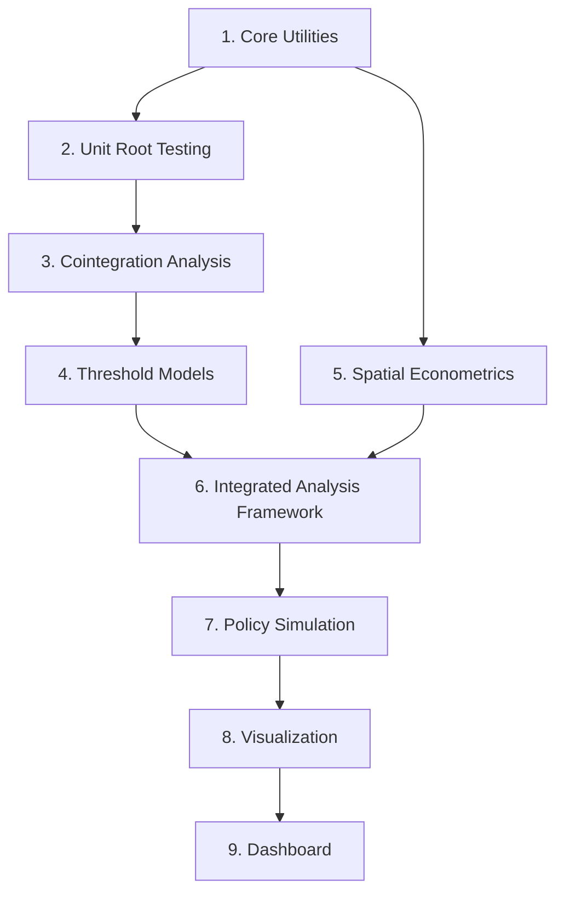

# Yemen Market Integration Project: Development Roadmap

This document integrates all implementation plans and outlines into a comprehensive development roadmap. It provides a prioritized sequence of development tasks, details dependencies between components, and offers pragmatic guidance for implementation.

## Development Sequence Overview

The project development follows this logical sequence:

## Phase 1: Core Foundation (Weeks 1-2)

### 1.1 Environment Setup and Core Utilities (Week 1)

- [x] Basic project structure (already in place)
- [x] Error handling utilities (already in place)
- [x] Validation functions (already in place)
- [x] Configuration management (already in place)
- [ ] Complete documentation of utility functions

### 1.2 Unit Root Testing Enhancements (Week 1-2)

- [x] Basic ADF and other unit root tests (already in place)
- [ ] Complete structural break detection
- [ ] Optimize performance for large datasets
- [ ] Add comprehensive documentation

### 1.3 Data Processing Pipeline (Week 2)

- [ ] Implement robust GeoJSON loading with error handling
- [ ] Create conflict data processing functions
- [ ] Implement exchange rate regime assignment
- [ ] Add transaction cost calculation functions

## Phase 2: Core Econometric Implementation (Weeks 3-5)

### 2.1 Cointegration Module (Week 3)

- [ ] Implement Engle-Granger cointegration tests
- [ ] Add Johansen multivariate cointegration
- [ ] Implement Gregory-Hansen test with structural breaks
- [ ] Create half-life calculation utilities
- [ ] Add vectorized operations for performance

**Dependencies**: Unit Root Testing module

### 2.2 Threshold Models (Week 4)

- [ ] Complete ThresholdCointegration class implementation
- [ ] Implement Momentum TAR (M-TAR) models
- [ ] Add support for exogenous conflict variables
- [ ] Implement threshold significance tests
- [ ] Create asymmetric adjustment diagnostics

**Dependencies**: Cointegration module

### 2.3 Spatial Econometrics (Week 4-5)

- [ ] Implement conflict-adjusted spatial weights
- [ ] Create spatial lag model (SLM) implementation
- [ ] Implement spatial error model (SEM)
- [ ] Add spatial Durbin model (SDM)
- [ ] Create market accessibility indices

**Dependencies**: Core utilities

## Phase 3: Integrated Analysis Framework (Weeks 6-7)

### 3.1 Connect Time Series and Spatial Components (Week 6)

- [ ] Create integrated analysis workflows
- [ ] Implement spatiotemporal modeling functions
- [ ] Create functions for extracting cointegration parameters by spatial relationship
- [ ] Add conflict barrier identification

**Dependencies**: Threshold Models and Spatial Econometrics modules

### 3.2 Model Diagnostics Enhancement (Week 6-7)

- [ ] Implement comprehensive residual diagnostics
- [ ] Add stability testing for parameter constancy
- [ ] Implement structural break detection in model results
- [ ] Create model selection criteria calculations

**Dependencies**: All econometric modules

## Phase 4: Policy Simulation (Weeks 8-10)

### 4.1 Exchange Rate Unification Simulation (Week 8)

- [ ] Implement price conversion to USD
- [ ] Create unified rate determination functions
- [ ] Implement price reconversion with unified rate
- [ ] Add model reestimation with simulated prices
- [ ] Create welfare metrics calculation

**Dependencies**: Threshold Models module

### 4.2 Connectivity Improvement Simulation (Week 9)

- [ ] Implement conflict reduction algorithms
- [ ] Create functions for recalculating spatial weights
- [ ] Add market accessibility recalculation
- [ ] Implement spatial model reestimation

**Dependencies**: Spatial Econometrics module

### 4.3 Combined Policy and Interaction Analysis (Week 10)

- [ ] Implement combined policy simulation
- [ ] Create policy interaction analysis functions
- [ ] Add welfare comparison metrics
- [ ] Implement robustness and sensitivity testing

**Dependencies**: Exchange Rate and Connectivity simulations

## Phase 5: Visualization and Reporting (Weeks 11-12)

### 5.1 Time Series Visualization (Week 11)

- [ ] Create specialized plots for threshold cointegration
- [ ] Implement regime-switching visualization
- [ ] Add asymmetric adjustment visualization
- [ ] Create publication-quality figure export

**Dependencies**: Threshold Models module

### 5.2 Spatial Visualization (Week 11-12)

- [ ] Implement market integration maps
- [ ] Create conflict-adjusted network visualization
- [ ] Add interactive filtering capabilities
- [ ] Implement time-series integration with maps

**Dependencies**: Spatial Econometrics module

### 5.3 Dashboard Components (Week 12)

- [ ] Create reusable dashboard components
- [ ] Implement policy comparison visualizations
- [ ] Add summary statistics components
- [ ] Create exportable report generation

**Dependencies**: All visualization components

## Testing Strategy

### Unit Testing

- [ ] Create tests for all core utility functions
- [ ] Implement tests for all econometric functions
- [ ] Add tests for simulation components

### Integration Testing

- [ ] Create tests for complete analysis workflows
- [ ] Implement policy simulation validation tests
- [ ] Add visualization integration tests

### Performance Testing

- [ ] Create benchmarks for memory-intensive operations
- [ ] Implement parallel processing validation
- [ ] Add performance tests for large datasets

## Immediate Implementation Priorities

Based on the implementation outlines, these are the immediate tasks to focus on:

1. **Cointegration Implementation** (Highest Priority)
   - Complete the `CointegrationTester` class in `src/models/cointegration.py`
   - Implement Johansen procedure for multivariate analysis
   - Add half-life calculation functions

2. **Threshold Models Enhancement** (High Priority)
   - Complete the M-TAR implementation in `src/models/threshold.py`
   - Add support for exogenous conflict variables
   - Implement asymmetric adjustment tests

3. **Spatial Econometrics Implementation** (High Priority)
   - Complete the `SpatialEconometrics` class in `src/models/spatial.py`
   - Implement conflict-adjusted weight matrices
   - Create market accessibility functions

4. **Documentation Completion** (Medium Priority)
   - Finish API documentation for all modules
   - Create usage examples for key functions
   - Update implementation status in implementation_plan.md

## Resource Allocation

### Critical Path Components

These components should receive the most development resources:

1. **Cointegration Module**: Foundation for all market integration analysis
2. **Threshold Models**: Core of the nonlinear price adjustment analysis
3. **Policy Simulation**: Critical for policy recommendations

### Bottleneck Identification

Potential bottlenecks to anticipate:

1. **Large Dataset Performance**: Especially for spatial analysis with many markets
2. **Model Reestimation**: Can be computationally expensive in simulations
3. **Visualization Rendering**: For complex maps with many markets and connections

### Performance Optimization Focus

Key areas for optimization:

1. **Spatial Weight Matrix Calculations**: Use sparse matrices
2. **Threshold Grid Search**: Implement parallelized search
3. **Simulation Parameter Sweeps**: Use parallel processing

## Validation and Quality Assurance

### Econometric Validation

- [ ] Validate against established econometric software (R, STATA)
- [ ] Compare results with published papers on threshold cointegration
- [ ] Verify spatial econometric results against GeoDa or similar tools

### Code Quality Metrics

- [ ] Maintain >90% test coverage for core modules
- [ ] Ensure full type annotation compliance
- [ ] Follow NumPy docstring convention consistently

### Documentation Requirements

- [ ] Keep API documentation synchronized with implementation
- [ ] Update implementation_plan.md as components are completed
- [ ] Create tutorial notebooks for main analysis workflows

## Risk Mitigation

### Technical Risks

1. **Complex Model Convergence**: Implementation may require adaptive algorithms
   - *Mitigation*: Implement multiple estimation approaches with fallbacks

2. **Memory Issues with Large Spatial Datasets**:
   - *Mitigation*: Use chunked processing and sparse representations

3. **Visualization Performance**:
   - *Mitigation*: Implement progressive rendering and data aggregation

### Project Risks

1. **Dependency Management**:
   - *Mitigation*: Clearly document dependencies between modules

2. **Feature Creep**:
   - *Mitigation*: Prioritize core econometric functionality over advanced features

3. **Performance vs. Accuracy Tradeoffs**:
   - *Mitigation*: Implement both fast and accurate versions of critical algorithms

## Development Best Practices

1. **Implementation Sequence**:
   - Start with core functionality before visualization
   - Implement models in order of dependency
   - Write tests alongside implementation
   - Document parameter interpretations and diagnostic checks

2. **Code Structure**:
   - Follow PEP 8 standards with NumPy docstrings
   - Use snake_case for functions and variables
   - Use CamelCase for classes
   - Prefix private functions with underscore

3. **Error Handling**:
   - Use the `handle_errors` decorator consistently
   - Implement validation with clear error messages
   - Provide fallback options when possible

4. **Performance Optimization**:
   - Vectorize operations where possible
   - Use memory-efficient data structures
   - Implement parallel processing for intensive operations
   - Apply M1/M2 optimizations when available

## Conclusion

This roadmap provides a comprehensive guide for completing the Yemen Market Integration project. By following the prioritized implementation sequence, focusing on core econometric models first, and maintaining robust testing and documentation practices, the project can be successfully implemented with high quality and performance.

The modular architecture allows for incremental development and testing, with clear dependencies between components. This approach supports both the research objectives of understanding market integration in conflict-affected Yemen and the practical goal of providing policy simulation tools for humanitarian and development interventions.
