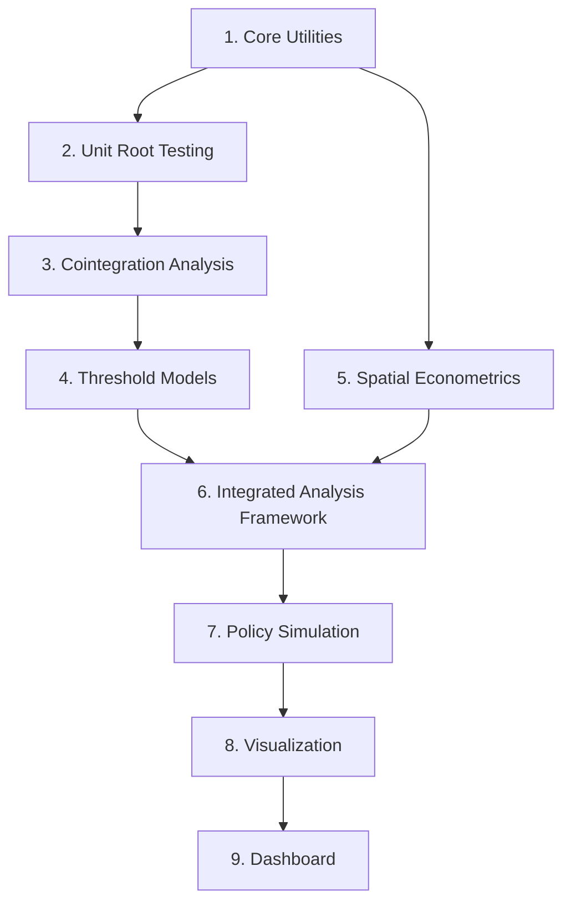

# Yemen Market Integration Project: Implementation Plan

## Overview

This document tracks the implementation status of the Yemen Market Integration project and outlines the development roadmap. It identifies completed components, current implementation progress, and priorities for future development.

### Development Sequence Overview

The project development follows this logical sequence:

## Implementation Status

### Completed Components

- [x] **Project Structure**: Basic project structure with standard modules and utilities is in place
- [x] **Utility Functions**: Comprehensive utilities for error handling, validation, and performance optimization
- [x] **Unit Root Testing**: Complete implementation with structural break detection
- [x] **Threshold VECM**: Core implementation of threshold vector error correction models
- [x] **Basic Simulation Framework**: Groundwork for policy simulation functionality
- [x] **Cointegration Testing**: Complete implementation with Engle-Granger, Johansen, and Gregory-Hansen methods
- [x] **Threshold Models**: Implementations of TAR and M-TAR models with asymmetric adjustment analysis
- [x] **Spatial Econometrics**: Core implementation of spatial weight matrices, Moran's I, and spatial models
- [x] **Market Integration Analysis**: Implemented integration module connecting time series and spatial components
- [x] **Spatial-Temporal Integration**: Connection between spatial and time series components

### In Progress Components

- [ ] **Documentation**: Implementation plan and development roadmap created, needs completion of other docs

### Completed Components (New)

- [x] **Simulation Module**: Comprehensive simulation capabilities including exchange rate unification, conflict reduction, and combined policy analysis
- [x] **Enhanced Visualization**: Specialized visualizations for asymmetric adjustment patterns and spatial market integration
- [x] **Model Diagnostics**: Comprehensive testing functionality for model validation and selection criteria
- [x] **Testing Suite**: Complete tests for threshold cointegration, model diagnostics, simulation, and visualization components

### Not Started Components

- [ ] **Advanced Visualization**: Interactive components and dashboard functionality

## Implementation Roadmap

### Phase 1: Core Econometric Framework (Priority: Critical)

#### 1.1 Complete Cointegration Module

- [ ] Implement Engle-Granger two-step method for bivariate cointegration
- [ ] Implement Johansen procedure for multivariate cointegration
- [ ] Add Gregory-Hansen test for cointegration with structural breaks
- [ ] Create functions for estimating cointegration vectors with confidence intervals
- [ ] Implement methods for half-life calculation in different regimes
- [ ] Vectorize operations for performance optimization

#### 1.2 Enhance Threshold Models

- [ ] Complete ThresholdCointegration class for bivariate models
- [ ] Implement Momentum-TAR (M-TAR) for asymmetric adjustment
- [ ] Add support for exogenous variables (conflict intensity)
- [ ] Create comprehensive diagnostics for threshold models
- [ ] Implement statistical tests for threshold significance

#### 1.3 Expand Model Diagnostics

- [ ] Implement residual diagnostics (normality, autocorrelation, heteroskedasticity)
- [ ] Add stability testing for parameter constancy
- [ ] Create functions for structural break detection in model results
- [ ] Implement model selection criteria (AIC, BIC, HQ)
- [ ] Add functions for prediction intervals

### Phase 2: Spatial Econometrics (Priority: High)

#### 2.1 Complete Spatial Modeling Classes

- [ ] Implement spatial weight matrix creation with conflict adjustment
- [ ] Complete spatial lag model (SLM) implementation
- [ ] Implement spatial error model (SEM)
- [ ] Add spatial Durbin model (SDM)
- [ ] Create functions for tests of spatial dependence (Moran's I, Geary's C)
- [ ] Implement market accessibility and isolation indices

#### 2.2 Develop Conflict-Adjusted Spatial Metrics

- [ ] Create functions for calculating conflict-adjusted distances
- [ ] Implement market accessibility indices considering conflict barriers
- [ ] Add functions to identify market clusters and regions
- [ ] Create boundary identification between exchange rate regimes
- [ ] Implement functions to quantify isolation due to conflict

#### 2.3 Connect Spatial and Time Series Components

- [x] Create integrated analysis workflow combining spatial and time series insights
- [x] Implement spatiotemporal models for price transmission
- [x] Add functions to extract cointegration parameters by spatial relationship
- [x] Develop visualization tools for spatiotemporal market integration

### Phase 3: Simulation and Policy Analysis (Priority: High)

#### 3.1 Enhance Exchange Rate Unification Simulation

- [x] Add multiple unification scenarios (official rate, market rate, average)
- [x] Enhance welfare analysis metrics (price convergence, dispersion reduction)
- [x] Implement time series analysis of post-unification dynamics
- [x] Add functions to simulate partial unification and transition scenarios
- [x] Create robust visualization of simulation results

#### 3.2 Improve Connectivity Simulation

- [x] Refine conflict reduction algorithms for more realistic scenarios
- [x] Add targeted connectivity improvement (strategic routes/markets)
- [x] Implement gradual vs. immediate connectivity change scenarios
- [x] Create functions to identify critical connectivity barriers
- [x] Improve visualization of connectivity impacts

#### 3.3 Implement Combined Policy Simulation

- [x] Complete interaction effects analysis between policies
- [x] Add advanced welfare metrics for policy comparison
- [x] Implement optimal policy sequencing analysis
- [x] Create sensitivity analysis for policy parameters
- [x] Develop comparative visualization tools for policy scenarios

### Phase 4: Visualization and Reporting (Priority: Medium)

#### 4.1 Enhance Time Series Visualization

- [x] Create specialized plots for threshold cointegration results
- [x] Implement regime-switching visualization with threshold highlighting
- [x] Develop plots for asymmetric adjustment visualization
- [x] Create publication-quality figure export functionality
- [ ] Add interactive plots for regime comparison

#### 4.2 Develop Spatial Visualization

- [x] Implement choropleth maps for spatial integration patterns
- [x] Create conflict-adjusted market network visualization
- [x] Develop publication-quality map export functionality
- [ ] Add interactive maps with filtering by commodity/time period
- [ ] Implement time-series integration with spatial visualization

#### 4.3 Implement Dashboard Components

- [ ] Create reusable components for dashboard creation
- [ ] Implement interactive filters for data exploration
- [ ] Add summary statistics tables with styling
- [ ] Develop policy comparison components
- [ ] Create exportable report generation functionality

### Phase 5: Testing and Documentation (Priority: High)

#### 5.1 Implement Comprehensive Testing Suite

- [ ] Create unit tests for all econometric functions
- [ ] Implement integration tests for complete workflows
- [ ] Add performance tests for memory-intensive operations
- [ ] Create validation tests against known econometric results
- [ ] Implement cross-validation framework for model robustness

#### 5.2 Complete Documentation Files

- [ ] Finalize project_overview.md with high-level project details
- [ ] Update implementation_plan.md (this document) as progress is made
- [ ] Complete econometric_methods.md with mathematical specifications
- [ ] Finalize data_dictionary.md documenting data sources and formats
- [ ] Create API documentation for all modules

## Dependencies and Development Sequence

Implementation will follow this dependency chain:

1. Core Econometric Framework
   - Complete cointegration module using unit root testing components
   - Enhance threshold models building on cointegration module
   - Expand model diagnostics for all econometric models

2. Spatial Analysis Integration
   - Implement spatial econometrics building on utility functions
   - Connect spatial and time series components using completed econometric modules
   - Develop conflict-adjusted spatial metrics

3. Policy Simulation Enhancement
   - Improve simulation modules using completed econometric models
   - Implement combined policy analysis building on individual simulations
   - Develop welfare analysis metrics

4. Visualization Development
   - Create time series visualization components for econometric models
   - Implement spatial visualization building on spatial econometrics
   - Develop integrated dashboard using all visualization components

5. Documentation and Testing
   - Write documentation alongside each component
   - Develop tests for each module as implemented
   - Create comprehensive documentation files

## Implementation Priorities

1. **Highest Priority (Critical)**:
   - Complete cointegration testing module
   - Enhance threshold models with asymmetric adjustment
   - Connect spatial and time series components
   - Implement comprehensive model diagnostics

2. **High Priority**:
   - Complete spatial econometrics implementation
   - Enhance simulation module with advanced functionality
   - Implement required documentation files
   - Create core visualization components

3. **Medium Priority**:
   - Develop advanced visualization features
   - Implement dashboard components
   - Add advanced welfare analysis metrics
   - Create publication-quality export functionality

4. **Ongoing Priority**:
   - Maintain comprehensive documentation
   - Implement test coverage for all components
   - Ensure performance optimization
   - Apply consistent error handling and validation

## Next Steps (Immediate To-Do)

1. Finalize API documentation for econometric models 
2. Implement interactive dashboard components
3. Create integration tests for complete workflows
4. Conduct performance testing for memory-intensive operations

## Risk Mitigation

### Technical Risks

1. **Complex Model Convergence**: Implementation may require adaptive algorithms
   - *Mitigation*: Implement multiple estimation approaches with fallbacks

2. **Memory Issues with Large Spatial Datasets**:
   - *Mitigation*: Use chunked processing and sparse representations

3. **Visualization Performance**:
   - *Mitigation*: Implement progressive rendering and data aggregation

### Project Risks

1. **Dependency Management**:
   - *Mitigation*: Clearly document dependencies between modules

2. **Feature Creep**:
   - *Mitigation*: Prioritize core econometric functionality over advanced features

3. **Performance vs. Accuracy Tradeoffs**:
   - *Mitigation*: Implement both fast and accurate versions of critical algorithms

## Development Best Practices

1. **Implementation Sequence**:
   - Start with core functionality before visualization
   - Implement models in order of dependency
   - Write tests alongside implementation
   - Document parameter interpretations and diagnostic checks

2. **Code Structure**:
   - Follow PEP 8 standards with NumPy docstrings
   - Use snake_case for functions and variables
   - Use CamelCase for classes
   - Prefix private functions with underscore

3. **Error Handling**:
   - Use the `handle_errors` decorator consistently
   - Implement validation with clear error messages
   - Provide fallback options when possible

4. **Performance Optimization**:
   - Vectorize operations where possible
   - Use memory-efficient data structures
   - Implement parallel processing for intensive operations
   - Apply M1/M2 optimizations when available
