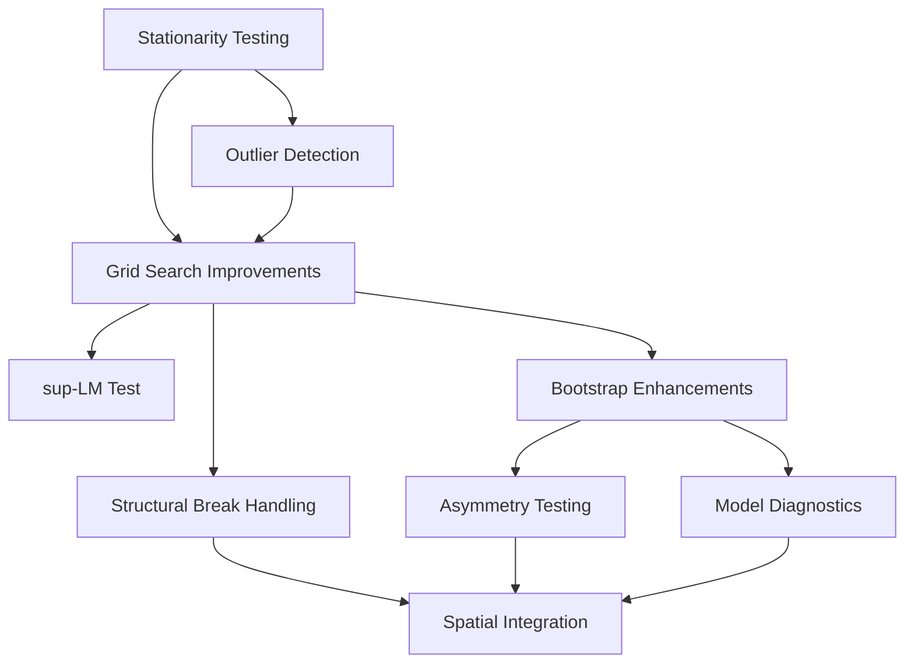

# Yemen Market Analysis Threshold Models Implementation Plan

## Overview

This document provides a detailed implementation plan for enhancing the Yemen Market Analysis threshold models. The improvements focus on better handling conflict-affected market data, enhancing model estimation techniques, improving diagnostics, and integrating with spatial econometric methods.

## Implementation Priorities

The implementation priorities are as follows:

1. **Essential Core Improvements** (High Priority)
   - Enhance unit root testing for stationarity with proper PP and ZA tests
   - Implement improved grid search algorithm with Hansen & Seo approach
   - Add sup-LM test for threshold significance
   - Add proper handling of structural breaks in cointegration relationships
   - Improve M-TAR implementation to better capture directional differences

2. **Diagnostic and Validation Tools** (Medium-High Priority)
   - Add Breusch-Godfrey LM test for serial correlation
   - Implement White's test for heteroskedasticity
   - Add Jarque-Bera test for normality
   - Create functions for sensitivity analysis

3. **Outlier Detection and Preprocessing** (Medium Priority)
   - Improve outlier detection for conflict-affected price data
   - Add dual exchange rate adjustment functions
   - Enhance visualizations for regime identification

4. **Advanced Integration Features** (Medium-Low Priority)
   - Connect threshold models with spatial econometrics
   - Add conflict intensity integration with transaction costs

5. **Performance Optimizations** (Low Priority)
   - Implement parallel processing for bootstrap operations
   - Optimize large dataset handling

## Dependency Structure and Implementation Sequence



The implementation should follow this sequence:

1. Start with stationarity testing and outlier detection
2. Improve grid search algorithms
3. Add hypothesis testing capabilities
4. Enhance diagnostic tools
5. Integrate with spatial models

## File-by-File Implementation Details

### 1. `src/models/unit_root.py` Changes

**Priority: High**

**Current Status:**

- PP test implemented as ADF fallback
- ZA test implemented as ADF fallback
- DF-GLS implemented but relies on ADF
- Incomplete bootstrap methods

**Specific Changes:**

```python
# Replace PP test implementation
def test_pp(self, data: pd.DataFrame, column: str = 'price', trend: str = 'c', max_lags: Optional[int] = None):
    # Use arch.unitroot.PhillipsPerron implementation
    pp_test = PhillipsPerron(data[column].dropna(), trend=trend, lags=max_lags)
    result = pp_test.summary()
    # Extract proper test statistics and critical values
    # Return results dictionary
```

```python
# Replace ZA test implementation
def test_za(self, data: pd.DataFrame, column: str = 'price', trend: str = 'c', max_lags: Optional[int] = None):
    # Use arch.unitroot.ZivotAndrews implementation
    za_test = ZivotAndrews(data[column].dropna(), trend=trend, lags=max_lags)
    result = za_test.summary()
    # Extract proper test statistics, critical values, and break date
    # Return results dictionary with break date
```

```python
# Improve DF-GLS test
def test_dfgls(self, data: pd.DataFrame, column: str = 'price', trend: str = 'c', max_lags: Optional[int] = None):
    # Use arch.unitroot.DFGLS implementation
    dfgls_test = DFGLS(data[column].dropna(), trend=trend, lags=max_lags)
    result = dfgls_test.summary()
    # Extract proper test statistics and critical values
    # Return results dictionary
```

### 2. `src/data/preprocessor.py` Changes

**Priority: Medium**

**Current Status:**

- Basic outlier detection methods (z-score, IQR, modified z-score)
- No conflict-specific methods
- No dual exchange rate handling

**Specific Changes:**

```python
# Add conflict-specific outlier detection
def detect_conflict_outliers(self, data: pd.DataFrame, price_column: str, 
                            conflict_column: Optional[str] = None, 
                            threshold: float = 2.0):
    """
    Detect outliers using conflict-aware methods.
    
    If conflict_column is provided, uses conflict intensity to adjust threshold.
    Otherwise uses robust methods with higher thresholds during conflict periods.
    """
    # Implementation logic for conflict-aware outlier detection
    # Returns mask of outlier points
```

```python
# Add dual exchange rate handling
def adjust_dual_exchange_rates(self, data: pd.DataFrame, price_column: str,
                              exchange_rate_columns: List[str], 
                              regime_column: Optional[str] = None):
    """
    Adjust prices based on multiple exchange rate regimes.
    
    Args:
        data: DataFrame with price and exchange rate data
        price_column: Column with price data
        exchange_rate_columns: Columns with different exchange rates
        regime_column: Column indicating which exchange rate regime applies
                      If None, attempts to infer regime
    
    Returns:
        DataFrame with adjusted prices
    """
    # Implementation logic for dual exchange rate adjustments
```

```python
# Add conflict-aware data transformation
def transform_conflict_affected_data(self, data: pd.DataFrame, price_column: str,
                                    conflict_column: str, method: str = 'robust_scaling'):
    """
    Transform conflict-affected price data using robust methods.
    
    Args:
        data: DataFrame with price data
        price_column: Column with price data
        conflict_column: Column with conflict intensity data
        method: Transformation method ('robust_scaling', 'segmented_scaling', etc.)
    
    Returns:
        DataFrame with transformed data
    """
    # Implementation logic for conflict-aware transformations
```

### 3. `src/models/threshold/model.py` Changes

**Priority: High**

**Current Status:**

- Basic integration of individual model implementations
- Limited model comparison options
- No structural break handling

**Specific Changes:**

```python
# Add support for structural breaks
def run_with_structural_breaks(self, break_dates: Optional[List[str]] = None, 
                              detect_breaks: bool = False):
    """
    Run threshold model analysis with structural breaks.
    
    Args:
        break_dates: List of known break dates. If None and detect_breaks is True,
                   breaks will be detected automatically.
        detect_breaks: Whether to automatically detect breaks if not provided.
    
    Returns:
        Dictionary with results for each regime and overall results.
    """
    # Implementation logic for structural break handling
```

```python
# Extend model comparison functionality
def compare_models_extended(self, criterion: str = 'bic', 
                           include_breaks: bool = True,
                           include_spatial: bool = False):
    """
    Extended model comparison with various specifications.
    
    Args:
        criterion: Information criterion for comparison ('aic', 'bic', 'hqic')
        include_breaks: Whether to include models with structural breaks
        include_spatial: Whether to include spatial threshold models
    
    Returns:
        Dictionary with comparison results
    """
    # Implementation logic for extended model comparison
```

### 4. `src/models/threshold/tar.py` Changes

**Priority: High**

**Current Status:**

- Basic grid search for threshold estimation
- Limited hypothesis testing
- No sup-LM test

**Specific Changes:**

```python
# Enhance grid search algorithm
def estimate_threshold(self, residuals: pd.Series, trim: float = 0.15, 
                     n_grid: int = 300, method: str = 'hansen_seo'):
    """
    Estimate threshold using improved grid search.
    
    Args:
        residuals: Series of residuals from cointegrating regression
        trim: Trimming parameter for grid search
        n_grid: Number of grid points
        method: Method for threshold estimation ('grid_search', 'hansen_seo', 'adaptive')
    
    Returns:
        Estimated threshold value
    """
    if method == 'hansen_seo':
        # Implement Hansen & Seo's concentrated MLE approach
        # This involves maximizing the likelihood function over the threshold parameter
        pass
    elif method == 'adaptive':
        # Implement adaptive grid search with finer grid in promising regions
        pass
    else:
        # Standard grid search (current implementation)
        pass
```

```python
# Add sup-LM test
def test_threshold_significance(self, residuals: pd.Series, threshold: float,
                              max_lags: int = 1, n_bootstrap: int = 1000,
                              method: str = 'sup_lm'):
    """
    Test for threshold significance using sup-LM test.
    
    Args:
        residuals: Series of residuals from cointegrating regression
        threshold: Estimated threshold value
        max_lags: Maximum number of lags for the test
        n_bootstrap: Number of bootstrap replications
        method: Testing method ('sup_lm', 'wald', 'lr')
    
    Returns:
        Dictionary with test results
    """
    # Implementation logic for sup-LM test
    # Uses bootstrap methods to calculate critical values
```

```python
# Enhance bootstrap methods
def bootstrap_threshold_test_enhanced(self, residuals: pd.Series, 
                                    n_bootstrap: int = 1000,
                                    method: str = 'parametric',
                                    parallel: bool = False):
    """
    Enhanced bootstrap test for threshold effect.
    
    Args:
        residuals: Series of residuals from cointegrating regression
        n_bootstrap: Number of bootstrap replications
        method: Bootstrap method ('parametric', 'nonparametric', 'wild')
        parallel: Whether to use parallel processing
    
    Returns:
        Dictionary with bootstrap test results
    """
    # Implementation logic for enhanced bootstrap methods
    # Includes parallel processing option for performance
```

### 5. `src/models/threshold/mtar.py` Changes

**Priority: Medium-High**

**Current Status:**

- Basic M-TAR implementation
- Limited options for momentum specification
- Basic asymmetry testing

**Specific Changes:**

```python
# Enhance Heaviside indicator function
def create_heaviside_indicators(self, residuals: pd.Series, threshold: float,
                              momentum_type: str = 'standard',
                              momentum_lag: int = 1):
    """
    Create Heaviside indicator functions for M-TAR model.
    
    Args:
        residuals: Series of residuals from cointegrating regression
        threshold: Threshold value
        momentum_type: Type of momentum specification
                     ('standard', 'moving_average', 'exponential')
        momentum_lag: Lag for momentum term
    
    Returns:
        Tuple of indicator series for above and below threshold
    """
    # Implementation logic for various momentum specifications
    if momentum_type == 'standard':
        # Current implementation using single lag
        pass
    elif momentum_type == 'moving_average':
        # Use moving average of past changes
        pass
    elif momentum_type == 'exponential':
        # Use exponentially weighted changes
        pass
```

```python
# Enhance asymmetry testing
def test_asymmetric_adjustment_enhanced(self, rho_above: float, rho_below: float,
                                      se_above: float, se_below: float,
                                      test_type: str = 'standard'):
    """
    Enhanced test for asymmetric adjustment in M-TAR model.
    
    Args:
        rho_above: Adjustment coefficient above threshold
        rho_below: Adjustment coefficient below threshold
        se_above: Standard error of rho_above
        se_below: Standard error of rho_below
        test_type: Type of asymmetry test
                 ('standard', 'bootstrap', 'joint')
    
    Returns:
        Dictionary with test results
    """
    # Implementation logic for various asymmetry tests
    if test_type == 'standard':
        # Current t-test implementation
        pass
    elif test_type == 'bootstrap':
        # Bootstrap-based test for robustness
        pass
    elif test_type == 'joint':
        # Joint test of asymmetry and threshold effect
        pass
```

### 6. `src/models/threshold/tvecm.py` Changes

**Priority: Medium**

**Current Status:**

- Basic TVECM implementation
- Limited testing for threshold effects
- No handling of structural breaks

**Specific Changes:**

```python
# Add structural break handling
def estimate_with_breaks(self, y: pd.DataFrame, x: pd.DataFrame,
                        y_col: str = 'price', x_col: str = 'price',
                        break_dates: List[str] = None,
                        detect_breaks: bool = False):
    """
    Estimate TVECM with structural breaks.
    
    Args:
        y: DataFrame containing the dependent variable
        x: DataFrame containing the independent variable
        y_col: Column name for the dependent variable
        x_col: Column name for the independent variable
        break_dates: List of known break dates
        detect_breaks: Whether to detect breaks automatically
    
    Returns:
        Dictionary with TVECM results for each regime
    """
    # Implementation logic for TVECM with structural breaks
```

```python
# Enhance grid search for TVECM
def estimate_threshold_enhanced(self, z_lag: pd.Series, trim: float = 0.15,
                              n_grid: int = 300, method: str = 'hansen_seo'):
    """
    Enhanced threshold estimation for TVECM.
    
    Args:
        z_lag: Lagged error correction term
        trim: Trimming parameter
        n_grid: Number of grid points
        method: Estimation method
    
    Returns:
        Estimated threshold value
    """
    # Implementation logic for enhanced threshold estimation in TVECM
```

### 7. `src/models/diagnostics.py` Changes

**Priority: Medium-High**

**Current Status:**

- Basic diagnostics for model evaluation
- Missing important diagnostic tests

**Specific Changes:**

```python
# Add Breusch-Godfrey LM test
def test_serial_correlation(self, residuals: pd.Series, 
                           max_lags: int = 4,
                           regressors: Optional[pd.DataFrame] = None):
    """
    Perform Breusch-Godfrey LM test for serial correlation.
    
    Args:
        residuals: Model residuals
        max_lags: Maximum number of lags to test
        regressors: Optional regressors from original model
    
    Returns:
        Dictionary with test results
    """
    # Implementation logic for Breusch-Godfrey test
```

```python
# Add White's test for heteroskedasticity
def test_heteroskedasticity(self, residuals: pd.Series,
                          regressors: pd.DataFrame,
                          test_type: str = 'white'):
    """
    Test for heteroskedasticity in residuals.
    
    Args:
        residuals: Model residuals
        regressors: Regressors from original model
        test_type: Test type ('white', 'breusch_pagan', 'goldfeld_quandt')
    
    Returns:
        Dictionary with test results
    """
    # Implementation logic for heteroskedasticity tests
```

```python
# Add Jarque-Bera test for normality
def test_normality(self, residuals: pd.Series, test_type: str = 'jarque_bera'):
    """
    Test for normality of residuals.
    
    Args:
        residuals: Model residuals
        test_type: Test type ('jarque_bera', 'shapiro_wilk', 'anderson_darling')
    
    Returns:
        Dictionary with test results
    """
    # Implementation logic for normality tests
```

```python
# Add sensitivity analysis functions
def analyze_sensitivity(self, model_func, data: pd.DataFrame,
                      params_to_vary: Dict[str, List[Any]],
                      output_metrics: List[str]):
    """
    Perform sensitivity analysis by varying model parameters.
    
    Args:
        model_func: Function that estimates the model
        data: Input data for the model
        params_to_vary: Dictionary mapping parameter names to lists of values
        output_metrics: List of output metrics to track
    
    Returns:
        DataFrame with sensitivity analysis results
    """
    # Implementation logic for sensitivity analysis
```

### 8. Create New File: `src/models/spatial_threshold.py`

**Priority: Medium-Low**

This new file will implement the integration between threshold models and spatial econometrics.

```python
"""
Spatial Threshold Modeling module for Yemen Market Analysis.

This module integrates threshold models with spatial econometrics
to analyze spatial market integration with transaction costs.
"""
import logging
from typing import Dict, List, Optional, Union, Any, Tuple

import pandas as pd
import numpy as np
import statsmodels.api as sm

from src.config import config
from src.utils.error_handling import YemenAnalysisError, handle_errors
from src.models.threshold.model import ThresholdModel
from src.models.spatial.models import SpatialModel

# Initialize logger
logger = logging.getLogger(__name__)

class SpatialThresholdModel:
    """
    Spatial Threshold Model for Yemen Market Analysis.
    
    This class integrates threshold models with spatial econometrics
    to analyze spatial market integration with transaction costs.
    
    Attributes:
        threshold_model: Threshold model instance
        spatial_model: Spatial model instance
    """
    
    def __init__(self, threshold_model=None, spatial_model=None):
        """
        Initialize the spatial threshold model.
        
        Args:
            threshold_model: Threshold model instance
            spatial_model: Spatial model instance
        """
        self.threshold_model = threshold_model
        self.spatial_model = spatial_model
    
    @handle_errors
    def estimate_with_conflict(self, price_data: pd.DataFrame, 
                             conflict_data: pd.DataFrame,
                             spatial_weights: pd.DataFrame,
                             price_col: str = 'price',
                             conflict_col: str = 'intensity',
                             threshold_type: str = 'tar'):
        """
        Estimate spatial threshold model with conflict intensity.
        
        Args:
            price_data: DataFrame with price data
            conflict_data: DataFrame with conflict intensity data
            spatial_weights: DataFrame with spatial weights
            price_col: Column name for price data
            conflict_col: Column name for conflict intensity
            threshold_type: Type of threshold model ('tar', 'mtar', 'tvecm')
        
        Returns:
            Dictionary with estimation results
        """
        # Implementation logic for spatial threshold model with conflict
```

## Testing Approach

### Unit Tests

1. Create or update unit tests for each new function:
   - `test_unit_root.py`: Test enhanced stationarity tests
   - `test_preprocessor.py`: Test conflict-specific preprocessing
   - `test_threshold.py`: Test enhanced threshold models
   - `test_diagnostics.py`: Test new diagnostic functions

2. Create integration tests that validate the entire workflow:
   - `test_yemen_market_analysis.py`: End-to-end test of conflict-affected market analysis

### Performance Testing

1. Add benchmarks for computationally intensive operations:
   - `benchmark_bootstrap.py`: Test bootstrap performance with and without parallelization
   - `benchmark_grid_search.py`: Test performance of different grid search methods

## Documentation

1. Update docstrings for all new functions and classes
2. Create usage examples in `examples/` directory:
   - `examples/threshold_with_conflict.py`: Example of threshold analysis with conflict data
   - `examples/spatial_threshold.py`: Example of spatial threshold analysis

## References to Literature

The implementation should follow methods described in:

1. Hansen, B. E., & Seo, B. (2002). Testing for two-regime threshold cointegration in vector error-correction models. Journal of Econometrics, 110(2), 293-318.
2. Balke, N. S., & Fomby, T. B. (1997). Threshold cointegration. International Economic Review, 38(3), 627-645.
3. Enders, W., & Siklos, P. L. (2001). Cointegration and threshold adjustment. Journal of Business & Economic Statistics, 19(2), 166-176.
4. Gregory, A. W., & Hansen, B. E. (1996). Residual-based tests for cointegration in models with regime shifts. Journal of Econometrics, 70(1), 99-126.

## Implementation Timeline

The implementation should follow this timeline:

1. **Week 1**: Implement core unit root and stationarity testing enhancements
2. **Week 2**: Implement threshold model refinements
3. **Week 3**: Implement diagnostic improvements
4. **Week 4**: Implement spatial integration
5. **Week 5**: Testing, documentation, and optimization

## Conclusion

This implementation plan provides a comprehensive roadmap for enhancing the Yemen Market Analysis threshold models. By following this plan, the codebase will better handle conflict-affected market data, provide more robust statistical testing, and enable deeper analysis of market integration during conflict.
