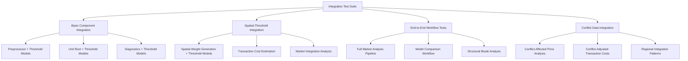

# Yemen Market Analysis Integration Test Suite Plan

## Overview

The goal is to create robust integration tests that validate how different components of the system work together, with special focus on the interactions between threshold models and spatial analysis. These tests will ensure that the full analytical pipeline functions correctly from data preprocessing to model integration to result interpretation.

## Test Suite Structure

## 1. Basic Component Integration Tests

These tests will verify that core components work correctly together:

1. **Preprocessor + Threshold Models Integration**
   - Test that preprocessed data can be properly fed into threshold models
   - Verify that outlier detection and handling works with threshold estimation
   - Test dual exchange rate adjustments affect cointegration analysis

2. **Unit Root Testing + Threshold Models Integration**
   - Verify that unit root test results correctly influence model selection
   - Test that stationarity is properly handled in the cointegration pipeline
   - Ensure Zivot-Andrews test results are properly used for structural break detection

3. **Diagnostics + Threshold Models Integration**
   - Test that diagnostic results correctly influence model validation
   - Verify the full cycle of model estimation → diagnostics → model refinement

## 2. Spatial-Threshold Integration Tests

These tests will focus specifically on the integration between spatial analysis and threshold models:

1. **Spatial Weight Matrix Generation and Integration**
   - Test creation of weight matrices from different input formats
   - Verify weight matrices are correctly applied in spatial threshold models
   - Test robustness to different spatial configurations

2. **Transaction Cost Estimation**
   - Test conflict-adjusted transaction cost calculations
   - Verify that transaction costs are correctly estimated across regions
   - Test the impact of different conflict scenarios on transaction costs

3. **Market Integration Analysis**
   - Test spatial patterns of market integration estimation
   - Verify that clusters of high/low integration are correctly identified
   - Test asymmetry analysis across spatial units

## 3. End-to-End Workflow Tests

These tests will validate complete analytical workflows:

1. **Full Market Analysis Pipeline**
   - Test the entire pipeline from data loading to final visualization
   - Verify all components work together under typical usage scenarios
   - Test handling of missing data throughout the pipeline

2. **Model Comparison Workflow**
   - Test the full model comparison process across different threshold specifications
   - Verify that information criteria are correctly calculated and compared
   - Test integration of spatial models in extended comparisons

3. **Structural Break Analysis Workflow**
   - Test structural break detection and incorporation into threshold models
   - Verify regime-specific estimations work correctly
   - Test comparison between models with and without breaks

## 4. Conflict Data Integration Tests

These tests will focus on conflict-specific functionality:

1. **Conflict-Affected Price Analysis**
   - Test preprocessing of conflict-affected price data
   - Verify that conflict intensity correctly influences market analysis
   - Test outlier detection in conflict vs non-conflict periods

2. **Conflict-Adjusted Transaction Costs**
   - Test conflict weight parameter effects on transaction costs
   - Verify transaction cost calculations in high vs low conflict scenarios
   - Test spatial patterns of transaction costs in conflict-affected regions

3. **Regional Integration Patterns**
   - Test how conflict affects regional market integration patterns
   - Verify that integration rates correctly reflect conflict intensity
   - Test identification of conflict-induced market segmentation

## Technical Implementation Approach

1. **Test Data Strategy:**
   - Create synthetic test datasets that mimic realistic market data
   - Include conflict intensity variations in test data
   - Create datasets with known cointegrating relationships and thresholds

2. **Test Structure:**
   - Use pytest fixtures for common test data and component initialization
   - Create modular test functions that can be composed for different scenarios
   - Add proper assertions to validate both intermediate and final outputs

3. **Mock Strategy:**
   - Use mocks for external dependencies (e.g., data sources)
   - Create partial mocks for slow components in fast tests
   - Implement realistic mock behaviors based on actual component behaviors

4. **Parameterization:**
   - Parameterize tests to cover various configurations
   - Test with different conflict intensities, market structures, and spatial configurations
   - Use parameters to test edge cases and boundary conditions

5. **Error Handling:**
   - Test proper propagation of errors across component boundaries
   - Verify that error handling is consistent across the integration points
   - Test recovery mechanisms for typical failure scenarios

## Implementation Plan

The implementation will be broken down into four subtasks, each corresponding to one of the main test categories:

1. Basic Component Integration Tests
2. Spatial-Threshold Integration Tests
3. End-to-End Workflow Tests
4. Conflict Data Integration Tests

Each subtask will be implemented by creating appropriate test files in the src/tests/integration directory.
