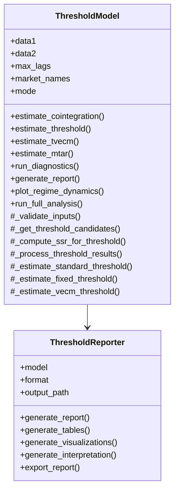

# Threshold Models Refactoring Plan

## Current State Analysis

After examining the three threshold model implementations (`threshold.py`, `threshold_fixed.py`, and `threshold_vecm.py`) and the project documentation, I've identified several issues:

1. **Code Redundancy**: There's significant duplication across the three implementations, particularly in threshold estimation, model diagnostics, and visualization.

2. **Architectural Inconsistencies**: 
   - `threshold.py` has a comprehensive implementation but suffers from multiprocessing issues
   - `threshold_fixed.py` is a simplified version with workarounds for multiprocessing
   - `threshold_vecm.py` implements a different approach (Hansen & Seo) but shares similar patterns

3. **Reporting Mechanism**: Each implementation has its own approach to reporting results, without a standardized format.

4. **Error Handling**: Inconsistent error handling across implementations, especially for multiprocessing.

5. **Performance Issues**: The multiprocessing implementation in `threshold.py` is causing errors, and the optimization decorators are inconsistently applied.

## Refactoring Goals

1. Create a unified threshold model implementation that maintains backward compatibility
2. Implement a standardized reporting mechanism as the default output
3. Fix multiprocessing issues and optimize performance
4. Reduce code redundancy while improving maintainability
5. Ensure proper error handling throughout

## Unified Model Approach

Instead of maintaining three separate model classes, we'll create a single `ThresholdModel` class with different operational modes. This approach offers several advantages:

1. **Simplified API**: Users only need to learn one class interface
2. **Reduced code duplication**: Common functionality is implemented once
3. **Easier maintenance**: Changes to core functionality only need to be made in one place
4. **Consistent behavior**: All modes follow the same patterns and conventions

## Architecture Design



## Implementation Details

### Unified ThresholdModel Class

The unified `ThresholdModel` class will support different modes through a mode parameter:

```python
class ThresholdModel:
    """
    Unified threshold model implementation with multiple operational modes.
    
    This class provides a comprehensive implementation of threshold cointegration
    models with support for different operational modes:
    
    - 'standard': Standard threshold cointegration (TAR)
    - 'fixed': Fixed threshold implementation with fallback mechanisms
    - 'vecm': Threshold Vector Error Correction Model (Hansen & Seo)
    - 'mtar': Momentum Threshold Autoregressive model
    """
    
    def __init__(
        self, 
        data1, 
        data2, 
        mode: str = "standard",
        max_lags: int = DEFAULT_MAX_LAGS,
        market1_name: str = "Market 1",
        market2_name: str = "Market 2",
        **kwargs
    ):
        """Initialize the threshold model."""
        # Validate mode
        valid_modes = ["standard", "fixed", "vecm", "mtar"]
        if mode not in valid_modes:
            raise ValueError(f"Invalid mode: {mode}. Must be one of {valid_modes}")
        
        self.mode = mode
        
        # Common initialization code
        # ...
```

### Standardized Reporting

The `ThresholdReporter` class will provide consistent reporting across all modes:

```python
class ThresholdReporter:
    """
    Standardized reporting for threshold models.
    
    This class provides a consistent reporting mechanism for all threshold
    model modes, supporting multiple output formats.
    """
    
    def __init__(
        self, 
        model: ThresholdModel, 
        format: str = "markdown", 
        output_path: Optional[str] = None
    ):
        """Initialize the reporter."""
        # ...
```

### Fixing Multiprocessing Issues

The threshold estimation will be implemented with robust multiprocessing and fallback mechanisms:

```python
def estimate_threshold(
    self, 
    n_grid: int = None, 
    trim: float = None
) -> Dict[str, Any]:
    """
    Estimate the threshold parameter using grid search.
    
    The threshold represents transaction costs between markets. When price
    differentials exceed this threshold, arbitrage becomes profitable and
    prices adjust more quickly.
    """
    # Use mode-specific defaults if not provided
    if n_grid is None:
        n_grid = DEFAULT_N_GRID if self.mode != "fixed" else 30
    
    if trim is None:
        trim = DEFAULT_TRIM
    
    # Dispatch to mode-specific implementation
    if self.mode == "standard":
        return self._estimate_standard_threshold(n_grid, trim)
    elif self.mode == "fixed":
        return self._estimate_fixed_threshold(n_grid, trim)
    elif self.mode == "vecm":
        return self._estimate_vecm_threshold(n_grid, trim)
    elif self.mode == "mtar":
        return self._estimate_mtar_threshold(n_grid, trim)
```

The fixed implementation will include a fallback to sequential processing:

```python
def _estimate_fixed_threshold(self, n_grid, trim):
    """Fixed threshold estimation with fallback to sequential processing."""
    # Get threshold candidates
    candidates = self._get_threshold_candidates(trim, n_grid)
    
    # Create DataFrame for parallelization
    df_candidates = pd.DataFrame({'threshold': candidates})
    
    try:
        # Try parallel processing with module-level functions
        logger.info(f"Starting grid search with {len(candidates)} threshold candidates")
        results_df = parallelize_dataframe(
            df_candidates,
            lambda chunk: process_chunk(chunk, self),
            n_cores=config.get('performance.n_cores', None)
        )
    except Exception as e:
        logger.warning(f"Parallel processing failed: {e}. Falling back to sequential processing.")
        # Fall back to sequential processing
        results = []
        for threshold in candidates:
            ssr = self._compute_ssr_for_threshold(threshold)
            results.append((threshold, ssr))
        results_df = pd.DataFrame({0: results})
    
    # Process results
    best_threshold, best_ssr, thresholds, ssrs = self._process_threshold_results(results_df)
    
    # Store results
    self.threshold = best_threshold
    self.ssr = best_ssr
    
    return {
        'threshold': best_threshold,
        'ssr': best_ssr,
        'all_thresholds': thresholds,
        'all_ssrs': ssrs,
        'proportion_below': np.mean(self.eq_errors <= best_threshold),
        'proportion_above': np.mean(self.eq_errors > best_threshold)
    }
```

## File Structure Changes

1. **New Files to Create**:
   - `src/models/threshold_model.py` - Unified threshold model implementation
   - `src/models/threshold_reporter.py` - Standardized reporting class

2. **Files to Modify**:
   - `src/run_integrated_analysis.py` - Update to use unified threshold model
   - `src/run_integrated_analysis_fixed.py` - Update to use unified threshold model
   - `src/run_integrated_analysis_with_fixed_threshold.py` - Update to use unified threshold model

3. **Files to Deprecate**:
   - `src/models/threshold.py` - Replace with unified implementation
   - `src/models/threshold_fixed.py` - Replace with unified implementation
   - `src/models/threshold_vecm.py` - Replace with unified implementation

## Backward Compatibility

To maintain backward compatibility with existing code:

1. **Wrapper Functions**: Create wrapper functions in the original files that instantiate the new unified model with the appropriate mode:

```python
# In threshold.py
def ThresholdCointegration(*args, **kwargs):
    """
    Backward compatibility wrapper for ThresholdCointegration.
    
    This function is deprecated and will be removed in a future version.
    Use ThresholdModel with mode='standard' instead.
    """
    warnings.warn(
        "ThresholdCointegration is deprecated. Use ThresholdModel with mode='standard' instead.",
        DeprecationWarning,
        stacklevel=2
    )
    return ThresholdModel(*args, mode="standard", **kwargs)
```

2. **Import Redirection**: Update imports in the original files to import from the new module:

```python
# In threshold.py
from src.models.threshold_model import ThresholdModel
```

3. **Documentation**: Provide clear migration guides in the documentation.

## Implementation Roadmap

### Phase 1: Core Implementation (Days 1-3)
1. Create `ThresholdModel` class with mode-specific implementations
2. Create standardized reporting class
3. Implement backward compatibility wrappers

### Phase 2: Fix Multiprocessing Issues (Days 4-5)
1. Implement robust multiprocessing with proper error handling
2. Add sequential fallback for threshold estimation
3. Optimize performance with proper decorators

### Phase 3: Standardize Reporting (Days 6-7)
1. Implement comprehensive report generation
2. Create standardized visualizations
3. Implement text interpretation generation

### Phase 4: Integration and Testing (Days 8-10)
1. Update main execution scripts to use unified model
2. Create comprehensive tests for all modes
3. Validate backward compatibility

## Advantages of Unified Approach

1. **Simplified API**: Users only need to learn one class interface
2. **Reduced code duplication**: Common functionality is implemented once
3. **Easier maintenance**: Changes to core functionality only need to be made in one place
4. **Consistent behavior**: All modes follow the same patterns and conventions
5. **Flexible configuration**: Mode-specific behavior is encapsulated in private methods
6. **Cleaner codebase**: Fewer files and classes to maintain

## Best Practices to Follow

1. **Error Handling**: Use `handle_errors` decorator consistently
2. **Validation**: Implement thorough input validation
3. **Documentation**: Use NumPy-style docstrings
4. **Performance**: Apply `m1_optimized` and `memory_usage_decorator` consistently
5. **Testing**: Create unit tests for all components
6. **Logging**: Use appropriate log levels and contextual logging