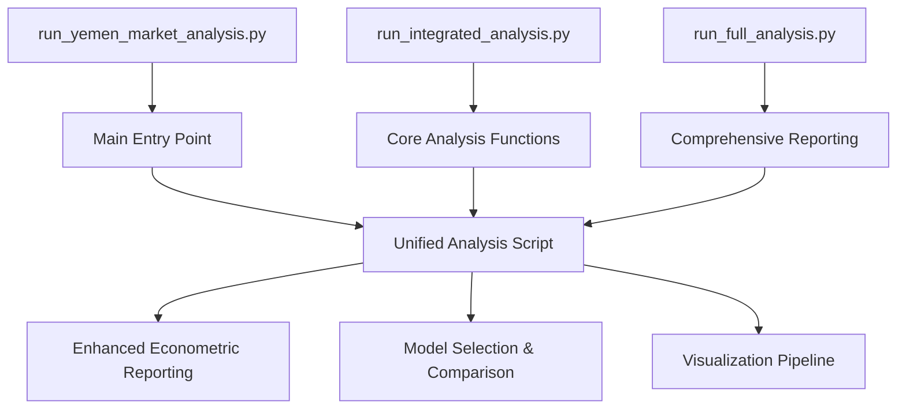
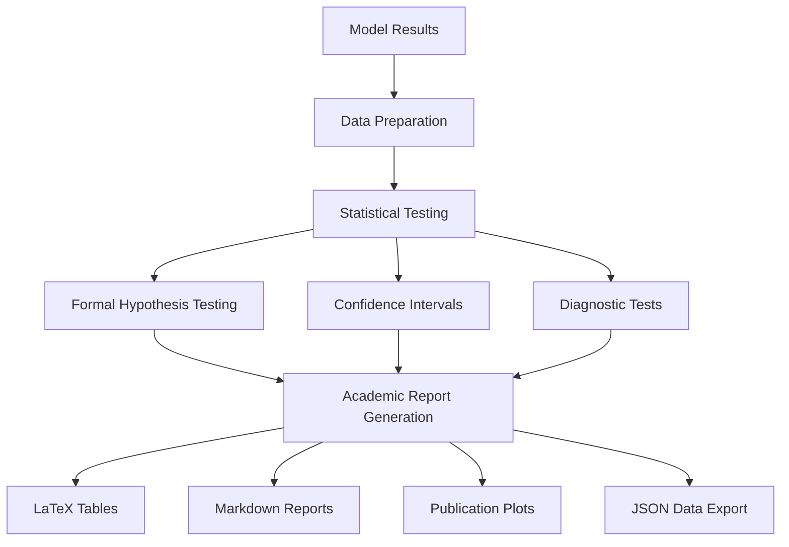
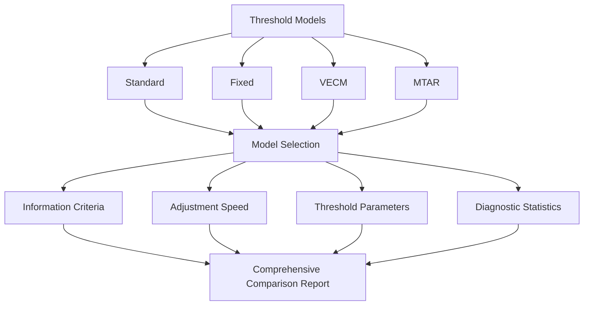
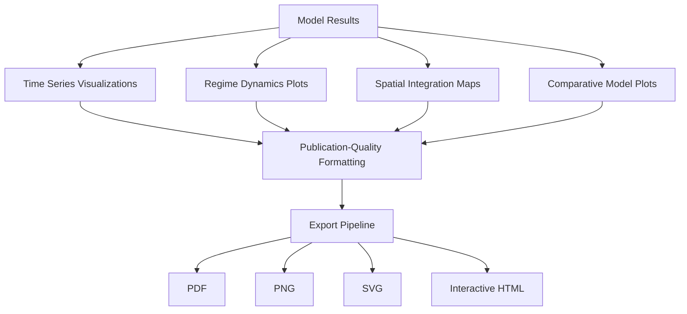

# Yemen Market Analysis Enhancement Plan

## Project Overview

This implementation plan outlines the approach for merging `run_yemen_analysis.py` and `run_full_analysis.py` scripts while enhancing the econometric reporting capabilities to meet both academic publication standards and World Bank requirements. The goal is to create a unified analysis framework with comprehensive model comparison and publication-quality visualizations.

## Current State Analysis

### Existing Scripts

1. **run_yemen_market_analysis.py**: Main entry point for market analysis with basic reporting
2. **run_full_analysis.py**: Comprehensive analysis with more detailed reporting
3. **src/run_integrated_analysis.py**: Core analysis functions for threshold models
4. **src/visualization/enhanced_econometric_reporting.py**: Current reporting module

### Current Limitations

1. Fragmented analysis workflows across multiple scripts
2. Reporting not fully aligned with academic econometric standards
3. Limited model comparison capabilities
4. Visualizations not optimized for publication
5. Inconsistent reporting formats across different model types

## Implementation Plan

### 1. Script Consolidation

#### 1.1 Create Unified Analysis Script

- Merge functionality from `run_yemen_market_analysis.py` and `run_full_analysis.py`
- Preserve command-line interface and argument structure from `run_yemen_market_analysis.py`
- Incorporate comprehensive analysis workflow from `run_integrated_analysis.py`
- Ensure backward compatibility with existing analysis pipelines

#### 1.2 Refactor Command-Line Interface

- Consolidate command-line arguments for all analysis types
- Add new parameters for enhanced reporting options
- Implement consistent parameter naming conventions
- Add detailed help documentation for all parameters

### 2. Enhanced Econometric Reporting Module

#### 2.1 Implement Academic Econometric Standards

- Formal hypothesis testing with p-values and significance indicators (*, **, ***)
- Confidence intervals for all parameter estimates (95% and 99%)
- Robust diagnostic tests:
  - Heteroskedasticity (White test, Breusch-Pagan)
  - Serial correlation (Breusch-Godfrey, Durbin-Watson)
  - Normality (Jarque-Bera)
  - Specification tests (Ramsey RESET)
- Standardized reporting formats following academic journal guidelines

#### 2.2 World Bank Reporting Enhancements

- Publication-quality tables with LaTeX export capability
- Comprehensive model comparison tables with statistical significance indicators
- Cross-commodity comparative analysis with standardized metrics
- Detailed interpretation of econometric results with policy implications
- Executive summary generation for non-technical audiences

### 3. Comprehensive Model Comparison Framework

#### 3.1 Enhanced Model Selection

- Implement comprehensive model selection based on multiple criteria:
  - Information criteria (AIC, BIC, HQC)
  - Likelihood ratio tests
  - Out-of-sample forecasting performance
  - Residual diagnostics
- Compare adjustment speeds across different threshold specifications
- Analyze threshold parameters and their economic significance
- Evaluate model diagnostics and goodness-of-fit measures

#### 3.2 Cross-Model Comparison

- Standardized comparison of different threshold model specifications
- Statistical tests for model selection (likelihood ratio tests)
- Comparative analysis of asymmetric adjustment processes
- Evaluation of model performance across different commodities
- Formal hypothesis testing for parameter differences across models

### 4. Publication-Quality Visualization Pipeline

#### 4.1 Enhanced Visualizations

- Implement standardized visualization styles following academic journal requirements
- Create regime dynamics plots showing threshold effects with confidence bands
- Develop spatial integration maps with conflict overlay
- Generate comparative model performance visualizations
- Add statistical significance indicators to all plots

#### 4.2 Visualization Export Pipeline

- Support multiple export formats (PDF, PNG, SVG)
- Implement consistent styling and formatting
- Add proper annotations, legends, and captions
- Create interactive versions for web-based exploration
- Ensure high-resolution outputs for publication

### 5. Implementation Steps and Timeline

#### Phase 1: Script Consolidation (Week 1)

1. Analyze existing scripts and identify core functionality
2. Design unified script structure
3. Merge command-line interfaces
4. Implement comprehensive logging
5. Test backward compatibility

#### Phase 2: Reporting Enhancement (Week 2)

1. Develop enhanced econometric reporting module
2. Implement academic reporting standards
3. Create LaTeX table generation
4. Add formal hypothesis testing framework
5. Implement confidence interval calculation

#### Phase 3: Model Comparison Framework (Week 3)

1. Implement comprehensive model selection
2. Develop cross-model comparison functionality
3. Add statistical significance testing
4. Create standardized comparison reports
5. Implement information criteria calculation

#### Phase 4: Visualization Pipeline (Week 4)

1. Enhance visualization capabilities
2. Implement publication-quality formatting
3. Create specialized econometric plots
4. Develop export pipeline
5. Add statistical annotations to plots

#### Phase 5: Testing and Documentation (Week 5)

1. Comprehensive testing of unified workflow
2. Documentation of new functionality
3. Example usage and tutorials
4. Performance optimization
5. Final integration and deployment

## Technical Implementation Details

### Key Files to Modify

1. **Create new unified script**:
   - `run_yemen_analysis_unified.py` (main entry point)

2. **Enhance reporting modules**:
   - `src/visualization/enhanced_econometric_reporting.py`
   - `src/models/reporting.py`
   - `src/models/threshold_reporter.py`

3. **Improve model comparison**:
   - `src/models/model_selection.py`
   - `src/models/threshold_model.py`

4. **Enhance visualization pipeline**:
   - `src/visualization/time_series.py`
   - `src/visualization/maps.py`
   - `src/visualization/dashboard_components.py`

### Implementation Approach

1. **Modular Design**: Create well-defined interfaces between analysis, reporting, and visualization components
2. **Backward Compatibility**: Ensure existing workflows continue to function
3. **Progressive Enhancement**: Implement features incrementally with testing at each stage
4. **Documentation**: Comprehensive documentation of new functionality and usage examples

## Expected Outcomes

1. A unified analysis script that combines functionality from multiple existing scripts
2. Enhanced econometric reporting that meets academic publication standards
3. Comprehensive model comparison framework with formal hypothesis testing
4. Publication-quality visualizations with statistical significance indicators
5. Improved user experience with better documentation and examples

## Success Criteria

1. All threshold model types (standard, fixed, VECM, MTAR) can be compared with formal statistical tests
2. Reports include confidence intervals and significance indicators for all parameters
3. Visualizations meet academic publication standards with proper annotations
4. Cross-commodity comparisons provide meaningful insights into market integration
5. Unified script maintains backward compatibility with existing workflows